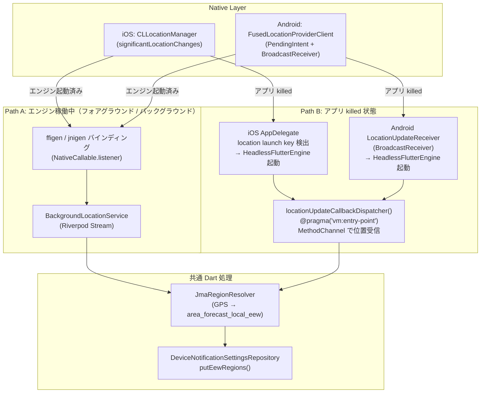

# バックグラウンド位置情報プラグイン実装計画

## 背景・解決する問題

### PK衝突バグ（今回の修正で同時解消）

- `device_eew_notification_setting` の PK は `(deviceId, regionId)`
- 「全国」（`regionId=0`）と「現在地」（`regionId=0`）が衝突 → INSERT 失敗
- 現在地に **実際の細分区域コード** を使うことで自然に解消される

### 設計方針: 2つの動作パス



### 地域コードの考え方

- EEW電文の地域コードは **`area_forecast_local_eew`**（細分区域、`9011` 北海道道央など）
- 現在地エントリには実際の細分区域コードを入れることで通知リゾルバのマッチングが正確になる
- 全国は引き続き `regionId=0`、PK衝突なし

## 1. 新パッケージ: `packages/background_location_tracker/`

**標準Flutterプラグイン**として作成する（Native Assets ではない）。
Pigeon が MethodChannel の boilerplate と型安全なコードを自動生成する。

### ファイル構成

```
packages/background_location_tracker/
├── pubspec.yaml
├── pigeons/
│   └── background_location.dart      # Pigeon API 定義（唯一の手書き定義ファイル）
├── lib/
│   ├── src/
│   │   ├── background_location.g.dart     # Pigeon 生成（dart run pigeon）
│   │   ├── location_update.dart           # Dart モデル (Freezed)
│   │   └── callback_dispatcher.dart       # @pragma vm:entry-point
│   └── background_location_tracker.dart   # 公開 API
├── ios/
│   ├── Classes/
│   │   ├── BackgroundLocationPlugin.swift        # FlutterPlugin 登録
│   │   ├── BackgroundLocationApi.g.swift         # Pigeon 生成
│   │   ├── SignificantLocationMonitor.swift       # CLLocationManager
│   │   └── LocationHeadlessRunner.swift          # Headless エンジン起動
│   └── background_location_tracker.podspec
└── android/
    └── src/main/kotlin/net/yumnumm/background_location_tracker/
        ├── BackgroundLocationPlugin.kt            # FlutterPlugin 登録
        ├── BackgroundLocationApi.g.kt             # Pigeon 生成
        ├── SignificantLocationMonitor.kt          # FusedLocationProviderClient
        ├── LocationUpdateReceiver.kt              # BroadcastReceiver
        └── LocationHeadlessRunner.kt             # Headless エンジン起動
```

### `pubspec.yaml`

```yaml
flutter:
  plugin:
    platforms:
      ios:
        pluginClass: BackgroundLocationPlugin
      android:
        package: net.yumnumm.background_location_tracker
        pluginClass: BackgroundLocationPlugin

dev_dependencies:
  pigeon: any
```

### Pigeon API 定義 (`pigeons/background_location.dart`)

```dart
@ConfigurePigeon(PigeonOptions(
  dartOut: 'lib/src/background_location.g.dart',
  swiftOut: 'ios/Classes/BackgroundLocationApi.g.swift',
  kotlinOut: 'android/src/main/kotlin/.../BackgroundLocationApi.g.kt',
  kotlinOptions: KotlinOptions(
    package: 'net.yumnumm.background_location_tracker',
  ),
))

// Flutter → Native（制御API）
@HostApi()
abstract class BackgroundLocationHostApi {
  /// コールバックハンドルをネイティブに永続保存
  void initialize(int callbackHandle);
  void startMonitoring();
  void stopMonitoring();
}

// Native → Flutter（Path A: エンジン稼働中の位置コールバック）
@FlutterApi()
abstract class BackgroundLocationFlutterApi {
  void onLocationUpdate(LocationUpdateMessage location);
}

class LocationUpdateMessage {
  LocationUpdateMessage({
    required this.latitude,
    required this.longitude,
    required this.accuracy,
  });
  final double latitude;
  final double longitude;
  final double accuracy;
}
```

コード生成コマンド:
```bash
mise exec -- dart run pigeon --input pigeons/background_location.dart
```

### Dart 公開 API

```dart
// lib/background_location_tracker.dart
class BackgroundLocationTracker {
  static final _hostApi = BackgroundLocationHostApi();
  static final _locationController = StreamController<LocationUpdate>.broadcast();

  /// アプリ起動時に必ず呼ぶ
  static Future<void> initialize() async {
    // FlutterApiのコールバックを登録
    BackgroundLocationFlutterApi.setUp(_FlutterApiHandler());
    // killed 状態復帰用にコールバックハンドルをネイティブへ永続保存
    final handle = PluginUtilities.getCallbackHandle(
      locationUpdateCallbackDispatcher,
    );
    await _hostApi.initialize(handle!.toRawHandle());
  }

  static Future<void> startMonitoring() => _hostApi.startMonitoring();
  static Future<void> stopMonitoring() => _hostApi.stopMonitoring();

  static Stream<LocationUpdate> get locationStream =>
      _locationController.stream;
}

class _FlutterApiHandler implements BackgroundLocationFlutterApi {
  @override
  void onLocationUpdate(LocationUpdateMessage location) {
    BackgroundLocationTracker._locationController.add(
      LocationUpdate(
        latitude: location.latitude,
        longitude: location.longitude,
        accuracy: location.accuracy,
      ),
    );
  }
}
```

## 2. Path A: エンジン稼働中の実装

### iOS: Swift + Pigeon 実装

`SignificantLocationMonitor.swift` で `CLLocationManager` をラップし、
位置変化時に Pigeon の `BackgroundLocationFlutterApi` 経由でDartに通知。

```swift
class BackgroundLocationPlugin: NSObject, FlutterPlugin, BackgroundLocationHostApi {
    private var flutterApi: BackgroundLocationFlutterApi?
    private let monitor = SignificantLocationMonitor()

    static func register(with registrar: FlutterPluginRegistrar) {
        let instance = BackgroundLocationPlugin()
        instance.flutterApi = BackgroundLocationFlutterApi(
            binaryMessenger: registrar.messenger()
        )
        BackgroundLocationHostApiSetup.setUp(
            binaryMessenger: registrar.messenger(),
            api: instance
        )
        instance.monitor.onLocationUpdate = { lat, lon, acc in
            instance.flutterApi?.onLocationUpdate(
                location: LocationUpdateMessage(
                    latitude: lat, longitude: lon, accuracy: acc
                )
            ) { _ in }
        }
    }

    func initialize(callbackHandle: Int64) throws {
        UserDefaults.standard.set(callbackHandle, forKey: "blt_callback_handle")
    }

    func startMonitoring() throws { monitor.start() }
    func stopMonitoring() throws { monitor.stop() }
}
```

### Android: Kotlin + Pigeon 実装

```kotlin
class BackgroundLocationPlugin : FlutterPlugin, BackgroundLocationHostApi {
    private var flutterApi: BackgroundLocationFlutterApi? = null
    private lateinit var monitor: SignificantLocationMonitor

    override fun onAttachedToEngine(binding: FlutterPlugin.FlutterPluginBinding) {
        flutterApi = BackgroundLocationFlutterApi(binding.binaryMessenger)
        BackgroundLocationHostApi.setUp(binding.binaryMessenger, this)
        monitor = SignificantLocationMonitor(binding.applicationContext) { lat, lon, acc ->
            flutterApi?.onLocationUpdate(
                LocationUpdateMessage(lat, lon, acc)
            ) {}
        }
    }

    override fun initialize(callbackHandle: Long) {
        context.getSharedPreferences("blt_prefs", Context.MODE_PRIVATE)
            .edit().putLong("callback_handle", callbackHandle).apply()
    }

    override fun startMonitoring() = monitor.start()
    override fun stopMonitoring() = monitor.stop()
}
```

## 3. Path B: アプリ killed 状態の実装

### コールバックディスパッチャー（Dart）

`lib/src/callback_dispatcher.dart`:

```dart
@pragma('vm:entry-point')
void locationUpdateCallbackDispatcher() {
  WidgetsFlutterBinding.ensureInitialized();

  const channel = MethodChannel('background_location_tracker/headless');
  channel.setMethodCallHandler((call) async {
    if (call.method == 'onLocationUpdate') {
      final lat = (call.arguments['latitude'] as num).toDouble();
      final lon = (call.arguments['longitude'] as num).toDouble();
      await _processLocationUpdate(lat, lon);
    }
  });

  // ネイティブに「Dart 側準備完了」を通知（2-way handshake）
  channel.invokeMethod('ready');
}

Future<void> _processLocationUpdate(double lat, double lon) async {
  // Widget tree 不要: ProviderContainer で直接 Riverpod を使う
  final container = ProviderContainer();
  try {
    final resolver = await container.read(jmaRegionResolverProvider.future);
    final code = resolver.resolveRegionCode(lat, lon);
    if (code == null) return;
    final deviceId = await container.read(deviceIdProvider.future);
    final repo = await container.read(
      deviceNotificationSettingsRepositoryProvider.future,
    );
    // 現在地エントリだけ更新
    await repo.putEewRegions(deviceId: deviceId, regions: [...]);
  } finally {
    container.dispose();
  }
}
```

> Riverpod は Widget tree に依存しないため、`ProviderContainer` を直接生成してHeadless環境でも利用できる（Zenn記事の「Riverpodの余談」と同じ根拠）。

### iOS: Headless エンジン起動

`LocationHeadlessRunner.swift` — `AppDelegate` から呼ばれる:

```swift
// AppDelegate.swift に追加
func application(_ app: UIApplication,
                 didFinishLaunchingWithOptions options: [UIApplication.LaunchOptionsKey: Any]?) -> Bool {
    if options?[.location] != nil {
        // killed 状態からの location wake-up
        LocationHeadlessRunner.shared.start()
    }
    return super.application(app, didFinishLaunchingWithOptions: options)
}
```

`LocationHeadlessRunner.swift`:

```swift
class LocationHeadlessRunner {
    private var headlessEngine: FlutterEngine?

    func start() {
        guard let handle = storedCallbackHandle,
              let info = FlutterCallbackCache.lookupCallbackInformation(handle)
        else { return }

        let engine = FlutterEngine(
            name: "location_headless",
            project: nil,
            allowHeadlessExecution: true
        )
        headlessEngine = engine
        engine.run(
            withEntrypoint: info.callbackName,
            libraryURI: info.callbackLibraryPath
        )
        // MethodChannel でハンドシェイク後に位置データを送信
        setupChannel(engine.binaryMessenger)
    }
}
```

### Android: BroadcastReceiver + Headless エンジン起動

`LocationUpdateReceiver.kt`:

```kotlin
class LocationUpdateReceiver : BroadcastReceiver() {
    override fun onReceive(context: Context, intent: Intent) {
        val result = LocationResult.extractResult(intent) ?: return
        val location = result.lastLocation ?: return
        LocationHeadlessRunner(context).start(location.latitude, location.longitude)
    }
}
```

`LocationHeadlessRunner.kt`:

```kotlin
class LocationHeadlessRunner(private val context: Context) {
    fun start(lat: Double, lon: Double) {
        val prefs = context.getSharedPreferences("blt_prefs", Context.MODE_PRIVATE)
        val handle = prefs.getLong("callback_handle", 0L)
        if (handle == 0L) return

        val loader = FlutterLoader().apply {
            startInitialization(context)
            ensureInitializationComplete(context, arrayOf())
        }
        val callbackInfo = FlutterCallbackInformation.lookupCallbackInformation(handle) ?: return

        val engine = FlutterEngine(context).apply {
            dartExecutor.executeDartCallback(
                DartExecutor.DartCallback(context.assets, loader.findAppBundlePath(), callbackInfo)
            )
        }
        // MethodChannel ハンドシェイク + 位置データ送信
        setupChannel(engine, lat, lon)
    }
}
```

`AndroidManifest.xml` に receiver 宣言が必要:

```xml
<receiver android:name=".LocationUpdateReceiver" android:exported="false" />
```

### `initialize()` でコールバックハンドルを登録

アプリ起動時（`main.dart` or `app.dart`）に `BackgroundLocationTracker.initialize()` を呼ぶ。
ネイティブ側は受け取ったハンドルを UserDefaults / SharedPreferences に永続化する。

## 4. 地域コード解決: `JmaRegionResolver`

### 境界データの準備

`packages/jma_map/bin/jma_map.dart` で **`area_forecast_local_eew`** の Protobuf バイナリを生成し、
`app/assets/parameters/area_forecast_local_eew.pb` として配置する（一回限りのビルドステップ）。

### 実装

`app/lib/feature/location/data/service/jma_region_resolver.dart`:

```dart
@riverpod
Future<JmaRegionResolver> jmaRegionResolver(Ref ref) async {
  // assets から Protobuf バイナリをロード（ネットワーク不要）
  final bytes = await rootBundle.load('assets/parameters/area_forecast_local_eew.pb');
  return JmaRegionResolver.fromBytes(bytes.buffer.asUint8List());
}

class JmaRegionResolver {
  /// geobase の point-in-polygon で GPS → area_forecast_local_eew code を解決
  int? resolveRegionCode(double lat, double lon);
}
```

assets からロードするため、**ネットワーク不要でヘッドレス環境でも動作**する。

## 5. App への統合

### Path A 用 Riverpod サービス

`app/lib/feature/location/data/service/background_location_service.dart`:

```dart
@riverpod
class BackgroundLocationService extends _$BackgroundLocationService {
  @override
  Stream<void> build() async* {
    yield* BackgroundLocationTracker.locationStream
        .asyncMap((loc) async {
          final resolver = await ref.read(jmaRegionResolverProvider.future);
          final code = resolver.resolveRegionCode(loc.latitude, loc.longitude);
          if (code != null) {
            await ref.read(eewSettingsProvider.notifier)
                .updateCurrentLocationRegion(code);
          }
        });
  }
}
```

### `EewSettingsNotifier` の変更

[`app/lib/feature/settings/features/notification_settings/data/notifier/eew_settings_notifier.dart`](app/lib/feature/settings/features/notification_settings/data/notifier/eew_settings_notifier.dart)

- `addCurrentLocationRegion()`: 現在地取得 → `JmaRegionResolver` で細分区域コード解決 → `regionId: <code>` で保存
- 新メソッド `updateCurrentLocationRegion(int regionCode)`: 現在地エントリを更新して `putEewRegions()` を呼ぶ

### パーミッション要求フロー

`addCurrentLocationRegion()` 呼び出し時:

1. `geolocator` で「常に許可（Always）」を要求（iOS）/ `ACCESS_BACKGROUND_LOCATION` を要求（Android）
2. 権限取得後 `BackgroundLocationTracker.startMonitoring()` を呼ぶ
3. `BackgroundLocationService` プロバイダを watch することで Path A が開始

### `main.dart` / `app.dart` への追加

```dart
// 起動時に必ず実行（killed 状態復帰時も含む）
await BackgroundLocationTracker.initialize();
```

## 6. バックエンド変更

**なし** — `region_id` は `integer` 型で値域制約なし。細分区域コード（9011等）はそのまま保存可能。

## 7. iOS / Android 設定変更

### iOS `Info.plist`

```xml
<key>NSLocationAlwaysAndWhenInUseUsageDescription</key>
<string>現在地の地震・緊急地震速報通知のために位置情報を常時利用します</string>
<key>NSLocationWhenInUseUsageDescription</key>
<string>現在地の地震情報表示に利用します</string>
<key>UIBackgroundModes</key>
<array>
  <string>location</string>
</array>
```

### Android `AndroidManifest.xml`

```xml
<uses-permission android:name="android.permission.ACCESS_BACKGROUND_LOCATION" />
<uses-permission android:name="android.permission.FOREGROUND_SERVICE_LOCATION" />

<receiver android:name=".LocationUpdateReceiver" android:exported="false" />
```

## 8. 作業順序

1. JMA GeoJSON 境界データの準備と Pb バイナリ生成（`jma_map` ツール活用）
2. `packages/background_location_tracker/` を標準プラグイン構成で作成
3. Pigeon API 定義 (`pigeons/background_location.dart`) → `dart run pigeon` でコード生成
4. Swift 実装（`SignificantLocationMonitor` + `BackgroundLocationPlugin` + `LocationHeadlessRunner`）
5. Kotlin 実装（`SignificantLocationMonitor` + `LocationUpdateReceiver` + `LocationHeadlessRunner` + `BackgroundLocationPlugin`）
6. iOS / Android パーミッション・マニフェスト設定
7. `callback_dispatcher.dart` 実装（`@pragma('vm:entry-point')`）
8. `JmaRegionResolver` 実装（geobase point-in-polygon）
9. `BackgroundLocationService` 実装 + `EewSettingsNotifier` 修正
10. `main.dart` に `BackgroundLocationTracker.initialize()` 追加
11. `melos bootstrap` + 動作確認

## 参照ファイル

- [`app/ios/Runner/AppDelegate.swift`](app/ios/Runner/AppDelegate.swift) — AppDelegate 修正対象
- [`app/android/app/src/main/kotlin/net/yumnumm/eqmonitor/MainActivity.kt`](app/android/app/src/main/kotlin/net/yumnumm/eqmonitor/MainActivity.kt) — Android 修正参照
- [`app/lib/feature/settings/features/notification_settings/data/notifier/eew_settings_notifier.dart`](app/lib/feature/settings/features/notification_settings/data/notifier/eew_settings_notifier.dart) — 修正対象
- [`packages/jma_map/bin/jma_map.dart`](packages/jma_map/bin/jma_map.dart) — 境界データ生成ツール
- [`app/lib/feature/location/data/location.dart`](app/lib/feature/location/data/location.dart) — 既存位置情報実装
