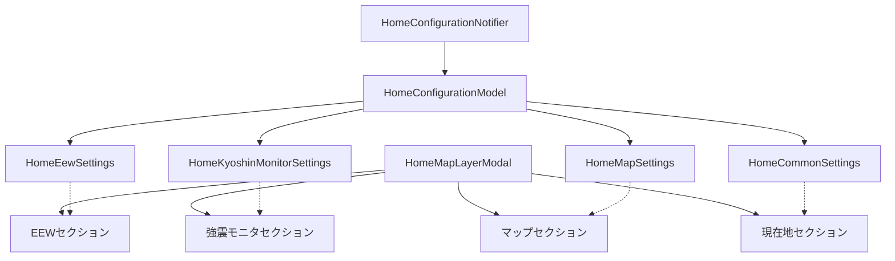

# ホーム設定項目追加 実装計画

## アーキテクチャ概要



## 1. データモデル再設計

### [`home_configuration_model.dart`](app/lib/feature/home/data/model/home_configuration_model.dart)

`HomeConfigurationModel` をサブモデルのコンテナに変更:

```dart
@freezed
abstract class HomeConfigurationModel with _$HomeConfigurationModel {
  const factory HomeConfigurationModel({
    @Default(HomeEewSettings())     HomeEewSettings     eew,
    @Default(HomeKyoshinMonitorSettings()) HomeKyoshinMonitorSettings kyoshinMonitor,
    @Default(HomeMapSettings())     HomeMapSettings     map,
    @Default(HomeCommonSettings())  HomeCommonSettings  common,
  }) = _HomeConfigurationModel;
  factory HomeConfigurationModel.fromJson(Map<String, dynamic> json) => ...;
}
```

### `HomeEewSettings`

```dart
@freezed
abstract class HomeEewSettings with _$HomeEewSettings {
  const factory HomeEewSettings({
    // 予想震度の塗りつぶし: 予想震度 / 警報地域 / なし
    @Default(HomeEewFillMode.intensity) HomeEewFillMode fillMode,

    // P/S波アニメーション更新レート
    @Default(HomeEewAnimationRate.unlimited) HomeEewAnimationRate animationRate,

    // EEW発生時に自動ズームするか
    @Default(true) bool autoZoom,

    // P波・S波の予報円を表示するか (false にするとレイヤーを非表示)
    @Default(true) bool showPSWaveCircle,
  }) = _HomeEewSettings;
}

@JsonEnum(alwaysCreate: true)
enum HomeEewFillMode {
  @JsonValue('intensity') intensity,  // 予想震度で塗りつぶし
  @JsonValue('warning')   warning,    // 警報地域を塗りつぶし
  @JsonValue('none')      none,       // 塗りつぶしなし
}

@JsonEnum(alwaysCreate: true)
enum HomeEewAnimationRate {
  @JsonValue('unlimited') unlimited,  // 制限なし
  @JsonValue('oneHz')     oneHz,      // 1Hz (毎秒1回)
}
```

### `HomeKyoshinMonitorSettings`

強震モニタ固有だが「ホーム画面として表示をどう扱うか」という観点のフィールドを持つ。`KyoshinMonitorSettingsModel`（API・データ取得設定）とは別系統。

```dart
@freezed
abstract class HomeKyoshinMonitorSettings with _$HomeKyoshinMonitorSettings {
  const factory HomeKyoshinMonitorSettings({
    // 指定した値以下の観測点を表示しない (null = 全て表示)
    @Default(null) double? minRealtimeShindo,

    // 観測点の表示サイズ倍率
    @Default(HomeKmoniMarkerSize.medium) HomeKmoniMarkerSize markerSize,
  }) = _HomeKyoshinMonitorSettings;
}

@JsonEnum(alwaysCreate: true)
enum HomeKmoniMarkerSize {
  @JsonValue('small')  small,
  @JsonValue('medium') medium,
  @JsonValue('large')  large,
}
```

> 注: `KyoshinMonitorSettingsModel.minRealtimeShindo` は既存だが責務が重複するため、`HomeKyoshinMonitorSettings.minRealtimeShindo` をホーム表示制御に使い、既存フィールドは廃止方向で検討。

### `HomeMapSettings`

```dart
@freezed
abstract class HomeMapSettings with _$HomeMapSettings {
  const factory HomeMapSettings({
    // 最大ズーム制限 (null = 無制限)
    @Default(null) double? maxZoom,

    // デフォルト表示範囲
    @Default(HomeMapDefaultBounds.mainIsland) HomeMapDefaultBounds defaultBounds,

    // ユーザー設定範囲 (defaultBounds == custom の場合のみ使用)
    @Default(null) HomeMapCustomBounds? customBounds,

    // 方位を常に北向きにロックするか (true のときカメラ回転を無効化)
    @Default(false) bool lockBearing,
  }) = _HomeMapSettings;
}

@freezed
abstract class HomeMapCustomBounds with _$HomeMapCustomBounds {
  const factory HomeMapCustomBounds({
    required double longitudeWest,
    required double longitudeEast,
    required double latitudeSouth,
    required double latitudeNorth,
  }) = _HomeMapCustomBounds;
}

@JsonEnum(alwaysCreate: true)
enum HomeMapDefaultBounds {
  @JsonValue('mainIsland') mainIsland,  // 九州〜北海道
  @JsonValue('all')        all,         // 全体 (沖縄含む)
  @JsonValue('custom')     custom,      // ユーザー設定
}
```

### `HomeCommonSettings`

既存の `showLocation` / `earthquakeHistoryScope` を移管:

```dart
@freezed
abstract class HomeCommonSettings with _$HomeCommonSettings {
  const factory HomeCommonSettings({
    // 現在地を地図上に表示する
    @Default(false) bool showLocation,

    // ホーム地震履歴の表示スコープ
    @Default(HomeEarthquakeHistoryScope.nationwide)
    HomeEarthquakeHistoryScope earthquakeHistoryScope,
  }) = _HomeCommonSettings;
}
```

### 既存 `EewDisplayMode` との関係

`EewDisplayMode` (`intensity`/`warning`) はEEW詳細画面用のまま維持。ホーム画面のEEWレイヤーは `HomeEewSettings.fillMode` で制御する。

## 2. 現在地パーミッション処理

[`location_tracking_mode.dart`](app/lib/feature/location/data/location_tracking_mode.dart) に `requestPermission()` メソッドを追加し、`Geolocator.requestPermission()` を呼び出す。

## 3. UI: `HomeMapLayerModal` 拡張

[`home_map_layer_modal.dart`](app/lib/feature/home/ui/component/map/home_map_layer_modal.dart) の `SliverList` に以下セクションを追加:

```
─── 緊急地震速報 ───────────────────────────────
  予想震度の塗りつぶし    [予想震度 / 警報地域 / なし]  ← SegmentedButton
  P/S波の予報円          [スイッチ]
  P/S波アニメーション     [制限なし / 1Hz]             ← SegmentedButton
  EEW発生時に自動ズーム   [スイッチ]
─── 現在地 ─────────────────────────────────────
  [権限なし時] 「位置情報の使用を許可する」FilledButton
  現在地を地図上に表示する [スイッチ]
─── 強震モニタ ──────────────────────────────────
  [既存] 強震モニタ詳細設定 → KyoshinMonitorSettingsModal
  観測点フィルター (最低リアルタイム震度) [Slider]
  観測点サイズ            [小 / 中 / 大]              ← SegmentedButton
─── マップ ──────────────────────────────────────
  方位ロック (常に北向き)  [スイッチ]
  最大ズームを制限         [スイッチ + Slider (4〜18)]
  デフォルト表示範囲       [本州 / 全体 / カスタム]    ← SegmentedButton
  [カスタム選択時] 「地図上で範囲を選択」ボタン
```

- セクションヘッダは `_SectionHeader` private widget で統一
- スイッチ系は `AppListTile.listTile` + `Switch` trailing
- SegmentedButton 系は `_RadioSegmentTile` private widget
- Slider 系は `_SliderTile` private widget

### カスタム表示範囲 矩形選択ページ

`app/lib/feature/home/ui/page/home_map_bounds_selector_page.dart` を新規作成:

- `MapLibreMap` をフルスクリーンで表示
- 2本指ドラッグ or ピンチ後に「この範囲を保存」ボタンで現在のカメラ範囲を `HomeMapCustomBounds` として保存する方式（矩形描画よりシンプルで使いやすい）

## 4. EEW レイヤーへの反映

ホームの EEW レイヤー実装を特定し `HomeEewSettings.fillMode` に応じて塗りつぶし分岐を追加。`showPSWaveCircle` に応じてP/S波円レイヤーの visibility を制御。

## 5. codegen・その他

- `home_configuration_model.dart` 変更後 `dart run build_runner build` を実行
- `HomeConfigurationNotifier` に `updateEew`, `updateKyoshinMonitor`, `updateMap`, `updateCommon` の4メソッドを追加（サブモデルごとに `copyWith` して `save`）

## 作業ファイル一覧

変更:
- `app/lib/feature/home/data/model/home_configuration_model.dart`
- `app/lib/feature/home/data/notifier/home_configuration_notifier.dart`
- `app/lib/feature/home/ui/component/map/home_map_layer_modal.dart`
- `app/lib/feature/location/data/location_tracking_mode.dart`

新規作成:
- `app/lib/feature/home/ui/page/home_map_bounds_selector_page.dart`
