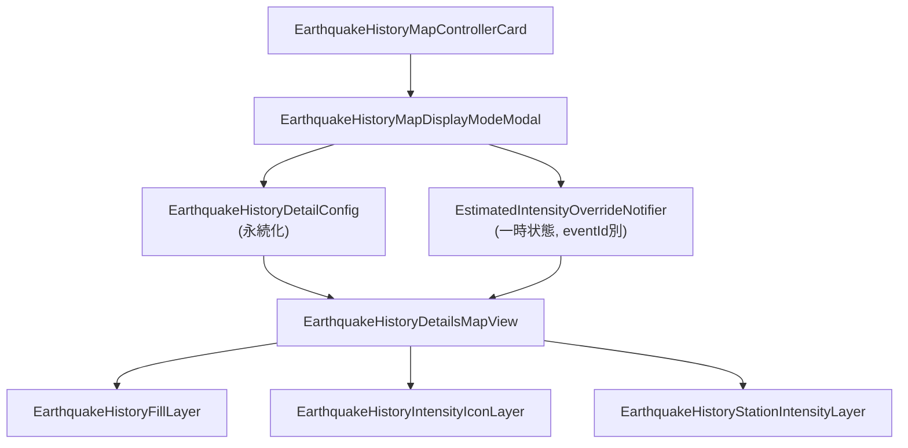

# 地図表示種別切替 実装計画

## アーキテクチャ概要



## 1. データモデル拡張

### [`earthquake_history_config_model.dart`](app/lib/feature/earthquake_history/data/model/earthquake_history_config_model.dart)

既存 `IntensityFillMode` を以下に変更（既存 `fillCity`/`fillRegion` は互換維持しつつ migration）:

```dart
enum IntensityFillMode {
  stationOnly,   // 観測点のみ (旧 none)
  fill,          // 塗りつぶし（ズームで region⇔city 自動切替）
  fillWithIcon,  // 塗りつぶし + 震度アイコン
}

enum StationDisplayMode {
  maxFocused,    // 最大震度を観測した観測点以外を縮小表示
  normal,        // 通常表示（全観測点同サイズ）
  allMinimized,  // すべて縮小表示
}

enum HypocenterDisplayMode {
  zoomFade,      // デフォルト: 低ズームでは不透明度0、ズームインで半透明表示
  alwaysOpaque,  // 常に不透明表示（観測点レイヤーの上）
  belowStations, // 常に不透明表示（観測点レイヤーの下）
}
```

`EarthquakeHistoryDetailConfig` に以下を追加:

- `StationDisplayMode stationDisplayMode`
- `HypocenterDisplayMode hypocenterDisplayMode`
- `bool showHypocenterError` (震央誤差矩形表示)
- `bool showStationLabel` (観測点名ラベル表示)

### 推計震度 override の状態設計

**永続化するもの** → `EarthquakeHistoryDetailConfig` に追加:

```dart
// 推計震度データがある場合に自動で推計震度モードを使うか
@Default(true) bool useEstimatedIntensityWhenAvailable,
```

**エフェメラル state** → `_MapContent` 内で `useState` フックを使用:

```dart
// 画面を開いた時点での初期値: tileUrl != null && config.useEstimatedIntensityWhenAvailable
final isOverriding = useState(tileUrl != null && config.useEstimatedIntensityWhenAvailable);
```

ユーザーがモーダルで設定を変更 → `isOverriding.value = false` かつ `config.useEstimatedIntensityWhenAvailable = false` を永続化。
次回以降その地震を開いたとき: config が `false` なら override なしでユーザー設定を使用。

## 2. レイヤー実装

### 新規: `earthquake_history_fill_layer.dart`

ベクタータイル `japan` ソースの `areaForecastLocalE`（地域）と `areaInformationCity`（市区町村）をズームで透明度フェードして切り替える FillStyleLayer を2つ追加。カラーは match 式。

- `areaForecastLocalE`: zoom 4〜8 で表示（zoom≥9 でフェードアウト）
- `areaInformationCity`: zoom 8〜9 でフェードイン

```dart
// region fill (zoom < ~9 で表示)
paint: {
  'fill-color': [...match expression...],
  'fill-opacity': ['interpolate', ['linear'], ['zoom'], 8.0, 0.6, 9.0, 0.0],
}
// city fill (zoom >= ~8 で表示)
paint: {
  'fill-color': [...match expression...],
  'fill-opacity': ['interpolate', ['linear'], ['zoom'], 8.0, 0.0, 9.0, 0.6],
}
```

境界線レイヤーも同様にフェード。

### 新規: `earthquake_history_intensity_icon_layer.dart`

`jmaMap` (`areaForecastLocalE` / `areaInformationCity`) の polylabel 座標に震度アイコン画像を Symbol レイヤーで表示。

- 事前に各震度レベルのアイコン画像を `addImageFromWidget` でマップに登録
- GeoJSON source にcode・intensity・polylabel座標を格納
- `icon-image` property で震度別に画像を切り替え
- `icon-size` をズームに応じて interpolate

### 修正: `earthquake_history_station_intensity_layer.dart`

`StationDisplayMode` を受け取り、GeoJSON features に `isFocused` プロパティを付与。

```dart
// StationDisplayMode.maxFocused の場合
// maxIntensity == earthquake全体のmaxIntensity なら isFocused=true
'circle-radius': [
  'interpolate', ['linear'], ['zoom'],
  4,
  ['case', ['get', 'isFocused'], 3, ['==', mode, 'allMinimized'], 1, 2],
  10,
  ['case', ['get', 'isFocused'], 10, ['==', mode, 'allMinimized'], 3, 7],
],
```

実際の実装では Dart 側で circle-radius を `StationDisplayMode` に応じた数値にして GeoJSON プロパティに持たせる方がシンプル。`isFocused`, `radius` プロパティをそれぞれ付与。

### 修正: `earthquake_history_hypocenter_layer.dart`

`HypocenterDisplayMode` を受け取り、`icon-opacity` の paint 式を切り替える:

```dart
// zoomFade: 低ズームで非表示、ズームインで半透明
'icon-opacity': ['interpolate', ['linear'], ['zoom'], 5, 0.0, 8, 0.6]

// alwaysOpaque / belowStations: 常に不透明
'icon-opacity': 1.0
```

`belowStations` のときの z 順制御は `earthquake_history_details_map_view.dart` 側でレイヤー描画順を入れ替えて対応（下記 §5 参照）。

### 新規: `earthquake_history_hypocenter_error_layer.dart`

座標精度から誤差矩形 (LineStyleLayer) を表示するレイヤー。

- GeoJSON source に矩形ポリゴン feature を格納
- `LineStyleLayer` で白い点線の矩形アウトラインを描画

```dart
paint: {
  'line-color': '#ffffff',
  'line-width': 1.5,
  'line-dasharray': [4, 2],
  'line-opacity': 0.8,
}
```

### 新規: `hypocenter_error_range_util.dart` + 単体テスト

```dart
/// 座標値の小数桁数から半精度（誤差）を計算する。
/// 例: 139.1  → 0.05 (10^-1 / 2)
/// 例: 139.16 → 0.005 (10^-2 / 2)
double halfPrecision(double value) {
  final str = value.toStringAsFixed(10).replaceAll(RegExp(r'0+$'), '');
  final dotIndex = str.indexOf('.');
  if (dotIndex == -1) return 0.5;
  final decimalPlaces = str.length - dotIndex - 1;
  return 0.5 * pow(10, -decimalPlaces);
}

/// CoordinateLatLng から誤差矩形 (GeoJSON Polygon coordinates) を生成する。
List<List<double>> hypocenterErrorPolygon(double lat, double lon) {
  final dLat = halfPrecision(lat);
  final dLon = halfPrecision(lon);
  return [
    [lon - dLon, lat - dLat],
    [lon + dLon, lat - dLat],
    [lon + dLon, lat + dLat],
    [lon - dLon, lat + dLat],
    [lon - dLon, lat - dLat], // close ring
  ];
}
```

単体テストケース (`test/feature/earthquake_history/hypocenter_error_range_util_test.dart`):

| 入力 (lat, lon) | 期待する dLat / dLon |
|---|---|
| (45.7, 139.1) | dLat=0.05, dLon=0.05 |
| (45.83, 139.16) | dLat=0.005, dLon=0.005 |
| (35.0, 135.0) | dLat=0.5, dLon=0.5 |
| (35.68, 139.769) | dLat=0.005, dLon=0.0005 |

### 修正: `earthquake_history_station_intensity_layer.dart`（観測点名ラベル追加）

`showStationLabel` が true のとき、Circle レイヤーの上に `SymbolStyleLayer` を重ねる。

```dart
// 観測点名ラベル用 SymbolLayer (同じ GeoJSON source を参照)
SymbolStyleLayer(
  id: '$_layerId-label',
  sourceId: _sourceId,
  layout: {
    'text-field': ['get', 'name'],
    'text-size': 10,
    'text-offset': [0, 1.2],
    'text-anchor': 'top',
    'text-allow-overlap': false,
  },
  paint: {
    'text-color': '#ffffff',
    'text-halo-color': '#000000',
    'text-halo-width': 1,
  },
)
```

### 既存レイヤーの整理

- `earthquake_history_region_intensity_layer.dart` → 削除し `earthquake_history_fill_layer.dart` に統合
- `earthquake_history_station_intensity_layer.dart` → StationDisplayMode 対応で更新

## 3. タップ検出 & ポップアップ

### `earthquake_history_details_map_view.dart`

`onEvent` コールバックで `MapEventClick` をハンドリングし、`MapController.queryLayers` で hit レイヤーを特定。

- fill レイヤーがヒット → 区域ポップアップ（区域名 + 最大震度）
- station レイヤーがヒット → 観測点ポップアップ（観測点名 + 震度 + 長周期地震動階級）

### 新規: `earthquake_history_map_popup.dart`

`showModalBottomSheet` or インラインの `AnimatedPositioned` で表示するポップアップウィジェット。

## 4. UI コンポーネント

### 新規: `earthquake_history_map_controller_card.dart`

`HomeMapControllerCard` と同じデザイン（Card + Column + Divider + InkWell）。

```
[ layers アイコン ] → EarthquakeHistoryMapDisplayModeModal を開く
```

推計震度 override 中は、地図右上に別途:

```
[ 推計震度データ表示中 ] ボタン (FilledButton.tonal 相当)
→ タップで EarthquakeHistoryMapDisplayModeModal を開く
```

### 新規: `earthquake_history_map_display_mode_modal.dart`

`EarthquakeHistoryDetailsMapLayerModal` を置き換え/拡張。

- 表示モード選択（3択）: 観測点のみ / 塗りつぶし / 塗りつぶし+アイコン
- 観測点のみ選択時のみ、サブモード（3択）を表示: 最大震度以外縮小 / 通常 / すべて縮小
- モーダルで変更 → `EstimatedIntensityOverride.setOverride(false)` して config 永続化

## 5. `earthquake_history_details_map_view.dart` 修正

```dart
final effectiveMode = (tileUrl != null && override)
    ? IntensityFillMode.stationOnly
    : config.intensityFillMode;

final hypocenterLayer = EarthquakeHistoryHypocenterLayer(
  earthquake: earthquake,
  displayMode: config.hypocenterDisplayMode,
);
final stationLayer = EarthquakeHistoryStationIntensityLayer(
  intensity: earthquake.intensity,
  displayMode: config.stationDisplayMode,
  maxIntensity: earthquake.intensity?.maxIntensity,
  showLabel: config.showStationLabel,
);

children: [
  // 塗りつぶし系（最背面）
  if (effectiveMode != IntensityFillMode.stationOnly)
    EarthquakeHistoryFillLayer(intensity: earthquake.intensity),
  if (effectiveMode == IntensityFillMode.fillWithIcon)
    EarthquakeHistoryIntensityIconLayer(intensity: earthquake.intensity),
  // 推計震度ラスタ
  if (tileUrl != null && override)
    EarthquakeHistoryDetailsEstimatedIntensityLayer(tileUrl: tileUrl),
  // 震央誤差矩形
  if (config.showHypocenterError)
    EarthquakeHistoryHypocenterErrorLayer(earthquake: earthquake),
  // 観測点・震央（z順を HypocenterDisplayMode で制御）
  if (config.hypocenterDisplayMode == HypocenterDisplayMode.belowStations)
    hypocenterLayer,
  stationLayer,
  if (config.hypocenterDisplayMode != HypocenterDisplayMode.belowStations)
    hypocenterLayer,
  EarthquakeHistoryDetailsMapCameraController(...),
],
```

## 6. 長周期地震動モード切替

既存 `showingLpgmIntensity` フラグを各マップレイヤーに伝播させる。

### 各レイヤーへの影響

| レイヤー | 通常モード | LPGM モード |
|---|---|---|
| StationIntensityLayer | `intensityTree` → `JmaIntensity` 色 | `lpgmIntensityTree` → `JmaLpgmIntensity` 色 |
| FillLayer | `regions` (maxIntensity) | `lpgmRegions` (maxLpgmIntensity) |
| IntensityIconLayer | `areaForecastLocalE` + 通常震度アイコン | `areaForecastLocalE` + LPGM アイコン |
| 凡例 | JmaIntensity 凡例 | JmaLpgmIntensity 凡例 |

カラーマッピングは `IntensityColorModel.fromJmaIntensity` / `fromJmaLpgmIntensity` で統一。モーダルのトグルで切り替え、設定は `EarthquakeHistoryDetailConfig.showingLpgmIntensity` に永続化。

## 7. Fit to Bounds

`fitBounds` にモバイル向け `maxZoom` がないため、`calculateZoomLevel` + `animateCamera` で実装。

```dart
void fitToObservationPoints({
  required EarthquakeIntensity? intensity,
  required CoordinateLatLng? hypocenter,
  required MapController controller,
  required Size screenSize,
  double maxZoom = 10.0,
  double padding = 0.8,
}) {
  // 全観測点 + 震源の緯度経度を収集
  final lats = <double>[], lngs = <double>[];
  for (final entry in intensity?.intensityTree.values ?? []) {
    for (final region in entry) {
      for (final city in region.cities) {
        for (final s in city.stations) {
          if (s.station.hasLatitude()) {
            lats.add(s.station.latitude);
            lngs.add(s.station.longitude);
          }
        }
      }
    }
  }
  if (hypocenter != null) {
    lats.add(hypocenter.latitude);
    lngs.add(hypocenter.longitude);
  }
  if (lats.isEmpty) return;

  final zoom = (calculateZoomLevel(
    minLat: lats.reduce(min), maxLat: lats.reduce(max),
    minLng: lngs.reduce(min), maxLng: lngs.reduce(max),
    screenWidth: screenSize.width, screenHeight: screenSize.height,
  ) + log(padding) / ln2).clamp(0.0, maxZoom);

  controller.animateCamera(
    center: Geographic(
      lon: (lngs.reduce(min) + lngs.reduce(max)) / 2,
      lat: (lats.reduce(min) + lats.reduce(max)) / 2,
    ),
    zoom: zoom,
  );
}
```

`EarthquakeHistoryMapControllerCard` に「全体表示」ボタン（`Icons.fit_screen` または `Icons.zoom_out_map`）を追加。`onMapCreated` で `MapController` を取得して渡す。

## 8. 震度凡例 (Legend)

### 表示仕様

- 表示中の震度範囲（実際に観測されている最小〜最大震度）だけを表示
- 通常モード: `JmaIntensity` のアイコン列（`IntensityIconType.filled` 角丸四角）
- LPGM モード: `JmaLpgmIntensity` のアイコン列
- 位置: マップ右下（SafeArea + padding）
- 設定でオン/オフ（`showLegend` bool、デフォルト true）

### 実装

```dart
// earthquake_history_map_legend.dart
class EarthquakeHistoryMapLegend extends ConsumerWidget {
  // 表示中の最小〜最大震度のアイコンを Row に並べる
  // JmaIntensityIcon(type: IntensityIconType.filled, size: 28)
  // 半透明の Card に内包
}
```

`EarthquakeHistoryDetailConfig` に `@Default(true) bool showLegend` を追加。

## 作業ファイル一覧

新規作成:

- `ui/layer/earthquake_history_fill_layer.dart`
- `ui/layer/earthquake_history_intensity_icon_layer.dart`
- `ui/layer/earthquake_history_hypocenter_error_layer.dart`
- `ui/components/earthquake_history_map_controller_card.dart`
- `ui/components/earthquake_history_map_popup.dart`
- `ui/components/earthquake_history_map_legend.dart`
- (削除) `data/notifier/earthquake_history_estimated_intensity_override_notifier.dart` → 不要（useState で代替）
- `ui/components/modal/earthquake_history_map_display_mode_modal.dart`（既存 layer_modal を置換）
- `core/util/map/hypocenter_error_range_util.dart`
- `test/feature/earthquake_history/hypocenter_error_range_util_test.dart`

変更:

- `data/model/earthquake_history_config_model.dart`（enum 追加 / `showLegend` / `showingLpgmIntensity` フィールド追加）
- `data/notifier/earthquake_history_config_notifier.dart`
- `ui/layer/earthquake_history_hypocenter_layer.dart`（HypocenterDisplayMode 対応）
- `ui/layer/earthquake_history_station_intensity_layer.dart`（StationDisplayMode / LPGM 切替 / ラベル表示）
- `ui/layer/earthquake_history_region_intensity_layer.dart`（→ fill_layer に統合後削除）
- `ui/components/earthquake_history_details_map_view.dart`（legend / fitBounds / LPGM 伝播）
- `ui/earthquake_history_details_page.dart`
