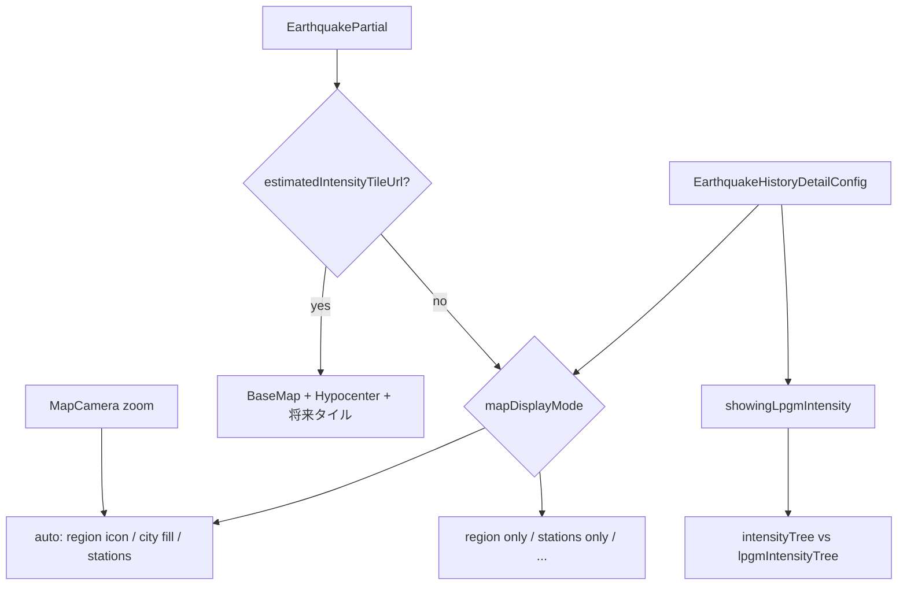

# (地震履歴詳細画面マップ実装計画（改訂）

## 現状

- 詳細ページは `[EarthquakeHistoryDetailsPage](app/lib/feature/earthquake_history/ui/earthquake_history_details_page.dart)` で `Stack` 上に `[EarthquakeHistoryDetailsMapView](app/lib/feature/earthquake_history/ui/components/earthquake_history_details_map_view.dart)` を全画面配置している。
- マップ本体は `**mapConfigurationProvider` が `styleString` を返した後も `Placeholder()` のまま**（未実装）。
- コメントアウトされた `_MapHeader` から、`[EarthquakeHistoryControllerCard](app/lib/feature/earthquake_history/ui/components/earthquake_history_controller_card.dart)` を載せる想定。
- データ: `[EarthquakePartial](app/lib/feature/earthquake_history/data/model/earthquake_partial.dart)` に `**hypocenter`**、`**estimatedIntensityTileUrl`**（推計震度 PMTiles URL）、`[EarthquakeIntensity](app/lib/feature/earthquake_history/data/model/earthquake_intensity.dart)`（`**intensityTree**`）、`[lpgmIntensityTree](app/lib/feature/earthquake_history/data/model/lpgm_intensity_tree.dart)` がある。

## 既存設定モデル（拡張の出発点）

`[EarthquakeHistoryDetailConfig](app/lib/feature/earthquake_history/data/model/earthquake_history_config_model.dart)` には既に次がある。

- `[IntensityFillMode](app/lib/feature/earthquake_history/data/model/earthquake_history_config_model.dart)`: `fillCity` / `fillRegion` / `none`
- `showIntensityIcon`、`showingLpgmIntensity`

本計画では **「自動モード」「観測点ラベル細分」「推計震度時の分岐」** を追加するため、`IntensityFillMode` の拡張、または **別 enum（例: `EarthquakeHistoryMapDisplayMode`）を新設**してマップ専用の組み合わせを表現する（後方互換のため JSON マイグレーション方針を決める）。

(マイグレーションの必要はない)

---

## 表示モード設計

### 1. 推計震度データがある場合（分岐・優先度）

- `**estimatedIntensityTileUrl != null` のとき**（ユーザー指示）:
  - **観測ベースの塗りつぶし（regions / 市区町村）は行わない**。
  - 地図はベーススタイル + 震源 +（将来）推計震度タイルのみ。**推計震度タイルの描画自体は今回スコープ外でよい**。
- 手動で「観測点のみ」等を選んでいても、**推計 URL があるイベントでは同じルールに落とすか**は product 判断。既定案: **推計優先で塗りつぶしオフ**（一覧性と誤解防止）。

### 2. 自動モード（`auto`）

観測データで塗りつぶす場合の挙動（推計震度なしのとき）。

- **塗りつぶし粒度**: **市区町村が取れる場合は市区町村、無ければ細分化地域（regions）** でポリゴン塗りつぶし。
  - 実装では `[intensity_tree](app/lib/feature/earthquake_history/data/model/intensity_tree.dart)` の `CityIntensityNode` / `RegionIntensityNode` と、JMA パラメータ・`[jma_map](app/lib/core/provider/map/jma_map_provider.dart)` のジオメトリ解決が必要。
- **ズーム連動（段階表示）**:
  - **低ズーム**: **細分化地域（regions）の重心**に震度アイコン（＋必要なら短いラベル）を配置。塗りつぶしは regions 基準。
  - **中ズーム**: **市区町村**の塗りつぶし＋市区町村単位のラベル／アイコン。
  - **高ズーム**: **観測点**を表示（下記「観測点ラベルモード」に従う）。
- **閾値**: `MapController` のカメラ zoom を購読し、定数（例: `zRegionIconsMax` / `zCityFillMin` / `zStationsMin`）で切替。**端末・画面幅差はまず固定閾値、必要なら後で調整**。

### 3. 手動モード（推計なし時）

- **常に regions のみ塗りつぶし**: 既存 `IntensityFillMode.fillRegion` に相当。ズームに依存せずポリゴンは regions のみ。
- **常に観測点表示**: 塗りつぶしなし（または任意で薄い regions 輪郭のみ）で **観測点レイヤーのみ**。
  - **ラベルサブモード**（設定で切替）:
    - **最大震度の観測点のみ**: 震度アイコン + 地点名（または「最大」旨の1ラベル）。
    - **すべて**: 各観測点に震度アイコン + 地点名（混雑時は衝突回避で非表示／縮小は後続）。

### 4. 用語対応（実装時の注意）

- コード上の `[RegionIntensityNode](app/lib/feature/earthquake_history/data/model/intensity_tree.dart)` コメントは「都道府県単位」だが、ユーザー要求の **「細分化地域 (regions)」** は JMA の **areaForecastLocalE 系の細分化**を指す可能性がある。**ジオメトリのキー（region code）と `intensity_tree` のノードが 1:1 か要確認**。ズーム「regions」は **実際に塗れるポリゴン単位**に合わせて命名を揃える。

---

## 長周期地震動階級（LPGM）の表示提案

`[lpgmIntensityTree](app/lib/feature/earthquake_history/data/model/lpgm_intensity_tree.dart)` は震度ツリーと同型の **地方→市区町村→観測点** 階層を持つ。既存 UI では `[showingLpgmIntensity](app/lib/feature/earthquake_history/data/model/earthquake_history_config_model.dart)` と `[LpgmIntensityIcon](app/lib/core/component/intenisty/lpgm_intensity_icon.dart)` 等がある。

**提案（マップ上）**

1. **マスター切替（推奨）**

- 詳細画面と同様、**「表示の基準 = 震度 / 長周期」の切替**（既存 `showingLpgmIntensity` をマップでも参照）。
- **ON のときはマップの色・ラベル・凡例を LPGM 階級に差し替え**（震度の塗りつぶし／点と同じレイヤー構造を別データソースで再利用）。

1. **視覚の分離**

- 将来「両方同時」が必要なら、震度=円、LPGM=ひし形／太枠など **形状で差別化**し、色はそれぞれのテーマ（`[intensity_color_provider](app/lib/core/provider/config/theme/intensity_color/intensity_color_provider.dart)` と LPGM 用パレット）に合わせる。

1. **自動モードとの整合**

- 自動モードのズーム段階（regions → 市区町村 → 観測点）は **LPGM でも同じ閾値**を使い、`lpgmIntensityTree` から同階層の値を取得。

1. **発表なし**

- `maxLpgmIntensity` が無い・ツリーが空のときは **LPGM マップレイヤーを出さない**（シート側の表示と一致）。

1. **推計震度あり**

- 震度塗りつぶしを止めるルールと同様、**LPGM のポリゴン塗りも出さない**か、**観測点のみ許可**かを決める。既定案: **推計震度表示予定のときは LPGM もポリゴン塗りは出さず、必要なら観測点のみ**（データが観測ベースのため誤解が少ない）。

---

## 技術制約（再掲）

- `[EewForecastRegionLayer](app/lib/feature/eew/ui/components/eew_forecast_region_layer.dart)`: **ベクタータイルのフィルター操作が未サポート**の記載あり → **ポリゴン塗りは GeoJSON 化（サーバ or アプリ内で jma_map からポリゴン生成）**が現実的。
- 推計震度: `**estimatedIntensityTileUrl` のランタイム追加**は別スパイク（`[maplibre](app/pubspec.yaml)`）。

---

## 推奨フェーズ（更新）

### フェーズ A — 基盤

- `MapLibreMap` + 初期カメラ + 震源レイヤー。
- `**MapController` 保持**と zoom 購読（自動モード用）。
- `**estimatedIntensityTileUrl` 分岐**: 塗りつぶし子ウィジェットを差し込まない。

### フェーズ B — 設定 UI + モデル

- `EarthquakeHistoryDetailConfig` 拡張（マップモード・ラベルモード・自動閾値の保存先）。
- コントローラカード／モーダルから切替。

### フェーズ C — ジオメトリ + レイヤー

- regions / 市区町村ポリゴン → GeoJSON `fill`。
- 重心・観測点座標 → `Symbol` / `Circle` + ラベル。
- 自動モードのズーム切替を実装。

### フェーズ D — LPGM

- `showingLpgmIntensity` 連動でデータソースを `lpgmIntensityTree` に切替、上記提案の視覚ルールを適用。

### フェーズ E — 推計震度タイル（任意・後追い）

- PMTiles スパイクとレイヤー追加。

---

## アーキテクチャ（概念）

---

## 単体テスト方針（重点）

MapLibre 本体やウィジェットを直接起動しない **純粋ロジック**にテストを集中させ、**分岐の網羅**と **不変条件（invariant）** の検証で不整合を防ぐ。既存の `[map_zoom_calculator](app/lib/feature/map/utils/map_zoom_calculator.dart)` の `[calculateZoomLevel](app/lib/feature/map/utils/map_zoom_calculator.dart)` と同様の粒度を目安にする。

### テスト対象にするレイヤー（優先度順）

1. **表示モード解決**（`mapDisplayMode` / 設定 / `estimatedIntensityTileUrl` / `showingLpgmIntensity` の組み合わせ）

- 入力: `EarthquakePartial`（またはテスト用 DTO）、`EarthquakeHistoryDetailConfig`、現在 zoom（自動モード用）。
- 期待: **推計 URL あり → 観測ベースの fill レイヤーを生成しない**（「何を出さないか」を表す enum または `MapLayerPlan` でも可）。
- 期待: **推計なし + 手動 regions / 観測点のみ** など、モードごとに `LayerPlan` が一意に決まること。

1. **ズーム段階**（自動モード）

- 閾値の前後（境界値）で **region アイコン / 市区町村 fill / 観測点** の切替が意図どおりか。
- 閾値が等しい・境界が重なる場合の **定義順**（どちらを優先するか）をテストで固定。

1. **GeoJSON／Feature 生成**（ジオメトリ解決後のデータ）

- 各 Feature の `properties`（震度・コード・ラベル用テキスト）が **ツリーと一致**すること。
- **重複キー・欠損座標**のときの扱い（スキップ／空の FeatureCollection）を明示しテストで固定。

1. **観測点ラベルモード**

- 「最大のみ文字付き」「全観測点文字付き」で **Feature 数・テキストフィールド**が期待どおりか。

1. **LPGM 切替**

- `showingLpgmIntensity` が true のとき **データソースが `lpgmIntensityTree` 参照**になること（震度の値が混ざらないこと）。

1. **設定の JSON 互換**

- `EarthquakeHistoryConfig` の **fromJson / toJson**（enum 追加・リネーム・欠損キー）で **既存保存値が壊れない**こと、デフォルトが仕様どおりか。

1. **カメラ初期化**（純粋関数に分離）

- 震源 lat/lng あり・**座標不明**・**震源 null** で `Geographic` と zoom が仕様どおりか（既存 `[JapanBounds](app/lib/feature/map/utils/map_zoom_calculator.dart)` の利用と整合）。

### ウィジェット／統合テストの位置づけ

- **ゴールデン／実機 MapLibre は最小限**（フレークしやすいため）。必要なら **ダミー `MapController`** で `onMapCreated` だけ検証する程度に留める。
- 回帰の主戦場は **単体テスト**。

### 実装時のルール

- 分岐が複雑なら `**MapVisualizationPolicy` のような単一クラス／トップレベル関数** に集約し、**テストしやすい形**にする（Widget にロジックを長く書かない）。
- 新規テストファイルは `app/test/feature/earthquake_history/...` 配下に配置し、**既存の `[test](app/test)` パターン**（`flutter_test`、fixture JSON）に合わせる。

---

## テスト観点（手動・E2E 補助）

- 推計 URL あり: 塗りつぶしが出ないこと（UI 確認）。
- 自動: ピンチズームで段階が切り替わること。
- LPGM 発表あり: 切替で凡例・地図が整合すること。
- 既存ユーザー設定: アプリ更新後も設定が読めること。

---

## 主な変更候補ファイル

- `[earthquake_history_details_map_view.dart](app/lib/feature/earthquake_history/ui/components/earthquake_history_details_map_view.dart)`
- `[earthquake_history_config_model.dart](app/lib/feature/earthquake_history/data/model/earthquake_history_config_model.dart)`（拡張 + `dart run build_runner`）
- 新規: 履歴詳細マップ用レイヤー群（fill / symbol）、ズーム分岐ロジック
- `[jma_map_provider](app/lib/core/provider/map/jma_map_provider.dart)`: ジオメトリ参照

**依存追加が必要な場合は `mise exec --` 経由で CLI から操作（ユーザー方針）。**
