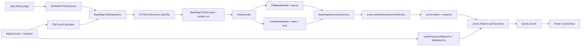

# Task 2: Flutter Scene map renderer maturity

調査日: 2026-08-07
対象: `/home/yumnumm/EQMonitor/packages/eqmonitor_map`

## 結論

`eqmonitor_map` の Flutter Scene renderer は、単なる `FlutterSceneSpike*` からは進んでおり、`BaseMapView` が現在の app 向け主経路になっている。PMTiles file source から MVT を decode し、Fill/Line mesh を組み、Flutter Scene の `SceneView` へ node/material/geometry として出す縦切りは実装済みで、app の debug page から実 PMTiles を使った simulator smoke も記録されている。

ただし Home Map 置換としてはまだ production ではない。実装成熟度は **foundation から alpha 手前**。理由は、`BaseMapView` 本体の widget/golden/performance test がなく、物理 iOS/Android profile/release 確認も未実施、ラベル・動的 layer・hit test・semantic・MapNode 公開 API が未実装で、line/flood/extent まわりに修正済みコードと未検証・古い記録が混在しているため。

## 1. Public exports / app consumption

公開 barrel は `/home/yumnumm/EQMonitor/packages/eqmonitor_map/lib/eqmonitor_map.dart`。

現在 app が直接使える主要 surface:

- `BaseMapView` と `MapBaseLayerLimits`
  - `/home/yumnumm/EQMonitor/packages/eqmonitor_map/lib/src/widget/base_map_view.dart`
  - app debug page が実際に import して使っている。
- `VerifiedPmTilesSource`
  - `/home/yumnumm/EQMonitor/packages/eqmonitor_map/lib/src/tile/verified_pm_tiles_source.dart`
  - app が Asset Pack 検証済み path/size/sha256/sourceInstanceId を package へ渡す契約。
- `MapCamera`
  - `/home/yumnumm/EQMonitor/packages/eqmonitor_map/lib/src/geo/map_camera.dart`
  - `BaseMapView` の初期 camera。
- `PmTilesV3Archive` / `PmTilesV3Header` / `PmTilesV3FileRandomAccessReader` / `PmTilesV3Limits`
  - `pmtiles_v3` から再 export。app が archive header の実測 zoom 範囲を読むため。
- `BaseMapTileDecodeLimits`, `MvtDecodeLimits`, `FillMeshBuilderLimits`, `LineMeshBuilderLimits`
  - 呼び出し側が decode/mesh/tile cache の上限を固定値ではなく明示するため。
- `EqmonitorOrthographicProjection`, `MapSceneRendererAdapter`, `SpikeMeshFrame`
  - spike/foundation 由来の surface。`MapSceneRendererAdapter` は interface だが、現行 `BaseMapView` はこれを経由していない。
- `BaseMapMaterialPreflightView`
  - material preflight 用。ただし実描画確認に疑義が残る記録がある。

app 側の実消費箇所:

- `/home/yumnumm/EQMonitor/app/lib/feature/settings/children/config/debug/eqmonitor_map/eqmonitor_map_debug_page.dart`
  - `BaseMapView(source, initialCamera, limits)` を表示。
- `/home/yumnumm/EQMonitor/app/lib/feature/settings/children/config/debug/eqmonitor_map/eqmonitor_map_debug_source_provider.dart`
  - `AssetPackRepository.resolveAsset(AssetPackAssetId.baseMapPmtiles)` から `VerifiedPmTilesSource` を作り、`PmTilesV3Header` で `minZoom` / `maxZoom` を読む。

まだ設計正本が想定する production public API (`EqmonitorMapView`, `EqmonitorMapController`, `MapScene`, typed `MapNode`) は実装・公開されていない。現公開 API は「base map debug/foundation renderer を app から起動するための最小 surface」に近い。

## 2. Spike vs BaseMapView

`FlutterSceneSpike*` はまだ残っているが、主経路ではない。

- `FlutterSceneSpikeView`
  - `/home/yumnumm/EQMonitor/packages/eqmonitor_map/lib/src/flutter_scene/flutter_scene_spike_view.dart`
  - example app の manual smoke harness。
- example
  - `/home/yumnumm/EQMonitor/packages/eqmonitor_map/example/lib/main.dart`
  - 今も `FlutterSceneSpikeView` を表示するだけで、`BaseMapView` example ではない。
- public barrel
  - `FlutterSceneSpikeView` は export されていない。
  - `/home/yumnumm/EQMonitor/packages/eqmonitor_map/lib/eqmonitor_map.dart` にも「physical-device Scene spike stays under src as a manual smoke harness」とある。

一方で `BaseMapView` は public export され、app debug page に接続済み。`BaseMapView` が `Scene.initializeStaticResources()`、PMTiles open、tile cover、decode、cache、Scene node rebuild、gesture pan/pinch を内部で持つため、現在の地図 renderer としては `BaseMapView` が `FlutterSceneSpike*` を supersede している。

ただし `BaseMapView` も最終 production API ではなく、debug/foundation view の位置づけ。

## 3. End-to-end pipeline

現在つながっている縦切り:

実装済みの主な要素:

- PMTiles file source
  - `/home/yumnumm/EQMonitor/packages/eqmonitor_map/lib/src/tile/base_map_tile_repository.dart`
  - `VerifiedPmTilesSource.absolutePath` を `PmTilesV3FileRandomAccessReader` で開く。欠損 tile は `null`、破損や範囲外は `PmTilesV3Exception` を伝播。
- MVT strict decode
  - `/home/yumnumm/EQMonitor/packages/eqmonitor_map/lib/src/tile/mvt/mvt_decoder.dart`
  - layer name/version/extent/features/geometry command を自前 decode。properties と feature ID は skip。
  - `MvtLayer.extent` は decode している。
- Base layer mapping
  - `/home/yumnumm/EQMonitor/packages/eqmonitor_map/lib/src/tile/base_map_tile_decoder.dart`
  - `baseMapLayerSpecs` は `background`, `countriesFill`, `countriesLine`, `areaForecastLocalEFill`, `areaForecastLocalEewLine`, `areaForecastLocalELine`, `areaInformationCityQuakeLine`。
  - Fill は Polygon のみ、Line は LineString と Polygon ring を閉じた line として mesh 化。
- Fill mesh
  - `/home/yumnumm/EQMonitor/packages/eqmonitor_map/lib/src/mesh/fill_mesh_builder.dart`
  - winding で exterior/hole を分類し、`dart_earcut` で triangulate。hole count、feature/segment vertex 上限あり。
- Line mesh
  - `/home/yumnumm/EQMonitor/packages/eqmonitor_map/lib/src/mesh/line_mesh_builder.dart`
  - miter join、butt cap、zero-length/duplicate vertex 除去、Uint16 segment 分割。bevel/round/dash/linesofar は未実装。
- Scene geometry
  - `/home/yumnumm/EQMonitor/packages/eqmonitor_map/lib/src/flutter_scene/base_map_geometry_factory.dart`
  - Fill/Line の 2D tile-local positions を 3D に拡張し `MeshGeometry.fromArrays` へ渡す。
  - Line extrude は custom attribute ではなく `texCoords` に載せる。
- Materials
  - `/home/yumnumm/EQMonitor/packages/eqmonitor_map/assets/base_map_fill.fmat`
  - `/home/yumnumm/EQMonitor/packages/eqmonitor_map/assets/base_map_line.fmat`
  - `/home/yumnumm/EQMonitor/packages/eqmonitor_map/lib/src/flutter_scene/base_map_material_library.dart`
  - layer ごとに material instance を作り、色を uniform へ設定。Line は `half_width_ndc` を viewport から再計算。
- Camera / transform
  - `/home/yumnumm/EQMonitor/packages/eqmonitor_map/lib/src/geo/tile_matrix.dart`
  - tile-local -> world の `tileMatrixFor` と、camera center rebasing 付き `viewProjectionMatrixFor`。
  - `BaseMapView` では Scene camera は identity にし、`viewProjection * tileMatrix` を node local transform へ焼き込む。
- Tile cover/cache/fallback
  - `/home/yumnumm/EQMonitor/packages/eqmonitor_map/lib/src/tile/tile_cover_calculator.dart`
  - bearing/pitch なしの矩形 cover。dateline wrap 対応、中心距離順 sort。
  - `/home/yumnumm/EQMonitor/packages/eqmonitor_map/lib/src/tile/base_map_tile_cache.dart`
  - `(sourceInstanceId, CanonicalTileId)` cache、LRU、非対称 zoom window、子4枚 fallback、親 fallback。

実機/simulator evidence:

- `/home/yumnumm/EQMonitor/packages/eqmonitor_map/README.md` に、iPhone 17 Pro simulator / iOS 27.0 で app debug page から `BaseMapView` を開き、本番相当 `all.pmtiles` z0..8 で日本の海岸線 Fill と pan による tile 差し替えを確認した記録がある。
- pinch zoom、物理端末 profile/release、background 色、線幅・tile 境界、祖先 fallback の視覚確認は未実施。

## 4. Known correctness issues / open risks

### Flood / line width

記録がやや矛盾している。

- README は、海が `areaForecastLocalEwLine` のオレンジで塗られたように見える既知不具合があり、原因/修正未着手と書いている。
  - `/home/yumnumm/EQMonitor/packages/eqmonitor_map/README.md`
- 一方で TODO には、真因は `Geometry.setCustomAttribute('extrude', ...)` が shader に届かず position が読まれていたこと、`texCoords` 経由へ変更する方針が記録されている。
  - `/home/yumnumm/EQMonitor/docs/todo/800_eqmonitor_map_deferred_verification.md`
- 現コードはその対策を取り込んでいる。
  - `/home/yumnumm/EQMonitor/packages/eqmonitor_map/lib/src/flutter_scene/base_map_geometry_factory.dart`
  - `/home/yumnumm/EQMonitor/packages/eqmonitor_map/assets/base_map_line.fmat`
  - `/home/yumnumm/EQMonitor/packages/eqmonitor_map/lib/src/flutter_scene/base_map_material_library.dart`

評価: flood の有力原因は code 上は対策済みに見えるが、README の確認結果は古く、対策後の実機/simulator再 smoke 証跡が見つからない。したがって「修正済み」と断言せず、**post-fix visual verification pending** と扱うべき。

### MVT extent

`MvtDecoder` は layer extent を読むが、`BaseMapTileGeometry` が extent を保持しないため、`BaseMapView` は transform に `mvtDefaultExtent` = 4096 を固定で渡している。

- decode: `/home/yumnumm/EQMonitor/packages/eqmonitor_map/lib/src/tile/mvt/mvt_decoder.dart`
- fixed use: `/home/yumnumm/EQMonitor/packages/eqmonitor_map/lib/src/widget/base_map_view.dart`
- risk memo: `/home/yumnumm/EQMonitor/docs/todo/800_eqmonitor_map_deferred_verification.md`

現 all.pmtiles の実測 layer extent は 4096 なので今は破綻しないが、設計上は layer/tile の実 extent を geometry まで伝播すべき。Home Map replacement 前には直すべき correctness debt。

### Holes / ring classification

unit test では hole 付き polygon の triangulation、hole-before-exterior reject、hole count limit は確認されている。

- `/home/yumnumm/EQMonitor/packages/eqmonitor_map/test/mesh/fill_mesh_builder_test.dart`

ただし TODO には「Polygon の穴を持つ実 tile fixture がない」とある。合成 fixture ではなく実 PMTiles 由来の regression fixture が未整備。

### Joins / caps

Line は miter join + butt cap のみ。MapLibre の bevel/round/flip bevel/fake round/dash/linesofar は未実装。

- `/home/yumnumm/EQMonitor/packages/eqmonitor_map/lib/src/mesh/line_mesh_builder.dart`
- `/home/yumnumm/EQMonitor/docs/knowledge/20260805_maplibre_native_renderer_reference.md`

鋭角は miter length clamp で見た目が崩れることを許容する実装。地図の行政界・海岸線で目立つ可能性は残る。

### Tile boundary / buffer / clipping

MVT extent を超える buffer 領域の scissor/clip は未実装。`FillMesh` / `LineMesh` は tile 境界外 vertex を保持して描画する。

- `/home/yumnumm/EQMonitor/docs/todo/800_eqmonitor_map_deferred_verification.md`

### Duplicate fallback rendering

複数 visible tile が同じ ancestor に fallback した場合、同じ ancestor geometry を複数 node として描く可能性がある。現在は不透明色なので目立たないが、半透明や blending を入れると問題になる。

### BaseMapView testing gap

`BaseMapView` 本体は widget test 対象外で、pure function の `cameraAfterGestureUpdate` / `canonicalZoomFor` だけを検証している。

- `/home/yumnumm/EQMonitor/packages/eqmonitor_map/test/widget/base_map_view_test.dart`

Scene/Gesture/PMTiles integration の自動回帰検出は弱い。

### Camera wiring

TODO には `scene.NodeCamera + EqmonitorOrthographicProjection` 配線では描画されない未修正問題があると記録されている。`BaseMapView` は identity camera + node transform 焼き込み方式なので回避しているが、spike/preflight 系の camera 経路は信頼できない可能性がある。

## 5. Toolchain constraints

固定値:

- Flutter SDK: `4dacd3fc91d96262a33e5c598e17d816f0b35641`
  - `/home/yumnumm/EQMonitor/docs/knowledge/20260802_eqmonitor_map_flutter_scene_toolchain.md`
- Flutter package constraint: `flutter: ^3.44.0`
  - `/home/yumnumm/EQMonitor/packages/eqmonitor_map/pubspec.yaml`
- Flutter Scene:
  - git `https://github.com/bdero/flutter_scene.git`
  - ref `7f71993b7e2a0ab1d2f59726a406098709be7291`
  - path `packages/flutter_scene`
  - `/home/yumnumm/EQMonitor/packages/eqmonitor_map/pubspec.yaml`
- `scene` dependency override:
  - same repo/ref, path `packages/scene`
  - hosted/floating fallback はしない。
  - `/home/yumnumm/EQMonitor/docs/knowledge/20260802_flutter_scene_scene_source_pin.md`

Flutter GPU / Impeller:

- Flutter Scene 0.20.0 は pre-1.0 で、新しい Flutter master と Flutter GPU を要求する。
- 実行時は `--enable-flutter-gpu --enable-impeller` が前提として知見化されている。
- `/home/yumnumm/EQMonitor/docs/knowledge/20260802_flutter_scene_large_static_instances.md`

Dart Data Assets:

- `.fmat` と Flutter Scene shader bundle は `flutter.assets` ではなく build hook の Dart Data Asset。
- package hook:
  - `/home/yumnumm/EQMonitor/packages/eqmonitor_map/hook/build.dart`
  - `assets/base_map_fill.fmat`, `assets/base_map_line.fmat` を build。
- app は project config で有効化済み:
  - `/home/yumnumm/EQMonitor/app/pubspec.yaml`
  - `flutter: config: enable-dart-data-assets: true`
- package example はまだ `enable-dart-data-assets: true` を持たないため、example build では machine ごとの `flutter config --enable-dart-data-assets` が必要。

Platform:

- `eqmonitorMapLibrary.supportedPlatforms`: `ios`, `android`
  - `/home/yumnumm/EQMonitor/packages/eqmonitor_map/lib/src/eqmonitor_map_library.dart`
- README の初期 scope も iOS/Android。Web/desktop/general-purpose package 化は初期 scope 外。

Dependency notes:

- `dart_earcut` for Fill triangulation。
- `pmtiles_v3` は local path dependency。
- `flutter_hooks` / `hooks` for widget/build hooks。

## 6. Production readiness for Home Map replacement

判定: **foundation / alpha 手前**。

できている:

- Flutter Scene fixed toolchain の package scaffold。
- app debug page から `BaseMapView` を開く導線。
- verified local PMTiles file source 契約。
- PMTiles -> MVT -> Fill/Line mesh -> Flutter Scene geometry/material/node -> camera transform の縦切り。
- unit test は decode、mesh、tile cover/cache、projection、geometry args など純粋ロジック中心にかなり厚い。
- BaseMapView simulator smoke で Fill と pan による tile 差し替えは確認記録あり。

まだ Home Map replacement を止めるもの:

- production public API (`MapScene` / `MapNode` / controller / reconciler) が未実装。
- ラベル、動的 layer、現在地、EEW/earthquake overlay、hit test、semantics が未実装。
- `BaseMapView` は debug HUD 付きで、Home UI の品質・error/loading/degraded state として未完成。
- `BaseMapView` 本体の widget/golden/performance tests がない。
- 物理 iOS/Android profile/release smoke 未実施。
- line rendering の post-fix visual evidence が不足し、README と TODO/code の状態がずれている。
- MVT extent 4096 固定の潜在バグが残る。
- remote PMTiles、attestation、signed sidecar、trusted tile pipeline は未実装。
- performance HUD/snapshot/event、GPU upload/memory/frame budget の測定が未実装。

推奨ゲート:

1. README/TODO/code の flood/line width 状態を再確認し、post-fix screenshot/log 付きで更新する。
2. `BaseMapTileGeometry` に layer/tile extent を伝播し、4096 固定をなくす。
3. `BaseMapView` の最低限の visual/golden or integration smoke を整備する。
4. iOS/Android 物理端末 profile/release で pan/pinch、resize/background、line visibility、tile boundary、fallback を確認する。
5. debug `BaseMapView` と production `EqmonitorMapView` / `MapScene` API の境界を明確化する。

現時点で Home Map を置き換えると、地図が出る可能性は十分あるが、生命に関わる情報表示の production surface としては未検証の描画差異・性能・操作回帰を検知できない。まずは debug renderer の correctness を閉じてから alpha integration に進む段階。
