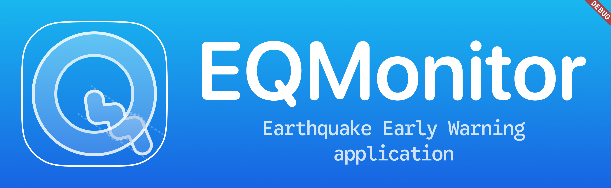

English follows Japanese.
English version is for reference.

# EQMonitorへのコントリビューション

## こんにちは! そして ようこそ👋

EQMonitorの開発に興味を持って頂きありがとうございます!
どんな理由であれ、

- [Issue](https://github.com/YumNumm/EQMonitor/issues)を作成する
  - 新機能の提案やバグの報告を行う
- [Pull Request](https://github.com/YumNumm/EQMonitor/pulls)を作成する
  - バグやtypoの修正やコードのリファクタリングを行う
- EQMonitorアプリから寄付する
  - サーバの運用経費や開発に関わる諸経費に利用させて頂きます
- **EQMonitorを利用する**
  - 最大の励みになります

> [!NOTE]
> このプロジェクトは、尾上 遼太朗(@YumNumm)が趣味で開発を始めたプロジェクトです。
> 私の実装したい機能を実装し、好きなように運用したいと思っています。開発を始めた当初より想定以上にアプリケーションを利用していただいていますが、基本的にこの考え方は変わっていません。
> そのため、素敵な実装やアイディアを提案していただいても、それを採用しない可能性があります。
>
> また、LLMによるコード生成やエージェントによりコードを生成し、大量にIssueやPRを作成する行為は、基本的にはお控えください。事前の通知をなしにユーザをブロックする可能性があります。

---

# Contributing to EQMonitor

## Hello and Welcome!👋

- Create an [Issue](https://github.com/YumNumm/EQMonitor/issues)
  - To propose new features or report bugs
- Create a [Pull Request](https://github.com/YumNumm/EQMonitor/pulls)
  - To fix bugs or typos or refactor code
- Donate to EQMonitor app
  - To cover the costs of running the server and development
- **Use EQMonitor**
  - To be the biggest motivation

> [!NOTE]
> This project is a project that I (@YumNumm, Ryotaro Onoue) started for fun.
> I want to implement the features I want to implement and operate it as I want.
> Since the beginning of the development, the application has been used more than expected. Therefore, even if you propose a great implementation or idea, it may not be adopted.
>
> Also, please refrain from creating a large number of Issues and PRs by LLM-based code generation or agents.
> There is a possibility that the user will be blocked without prior notice.
