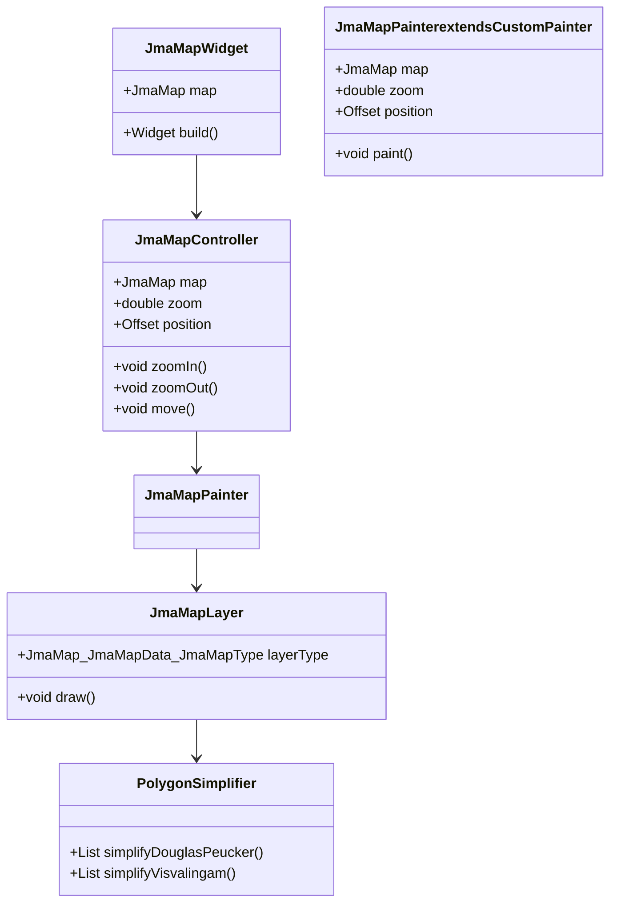

# JMA Map 実装計画

## 概要

C#で実装された`KyoshinEewViewer.Map`を参考に、Flutterで地図描画機能を実装します。地図データはJMA Mapのプロトコルバッファを使用します。

## アーキテクチャ



## 主要コンポーネント

### 1. JmaMapWidget

- CustomPaintを使用して地図を描画するウィジェット
- ジェスチャー検出（ピンチズーム、パン）の実装
- JmaMapControllerを使用して状態を管理

```dart
class JmaMapWidget extends StatefulWidget {
  final JmaMap map;

  const JmaMapWidget({Key? key, required this.map}) : super(key: key);

  @override
  _JmaMapWidgetState createState() => _JmaMapWidgetState();
}
```

### 2. JmaMapController

- 地図の状態（ズーム、位置）を管理
- ジェスチャーに応じた状態更新
- レイヤーの管理

```dart
class JmaMapController {
  final JmaMap map;
  double zoom;
  Offset position;

  // レイヤー設定
  List<JmaMapLayerSet> layerSets;

  // ズームレベルに応じたレイヤータイプの取得
  JmaMap_JmaMapData_JmaMapType getLayerType(double zoom) {
    // C#のLandLayerSetExtensionsに相当する実装
  }
}
```

### 3. JmaMapPainter

- CustomPainterを継承して実際の描画ロジックを実装
- C#の`LandLayer.Render`に相当する機能

```dart
class JmaMapPainter extends CustomPainter {
  final JmaMapController controller;

  @override
  void paint(Canvas canvas, Size size) {
    // C#のLandLayer.Renderに相当する実装
    // 1. 使用するレイヤーの決定
    // 2. 座標変換
    // 3. ポリゴンの描画
  }
}
```

### 4. JmaMapLayer

- 各レイヤータイプに対応する描画ロジック
- C#の`PolygonFeature.Draw`に相当する機能

```dart
class JmaMapLayer {
  final JmaMap_JmaMapData_JmaMapType layerType;
  final JmaMap map;

  // キャッシュ
  final Map<int, Path> pathCache = {};

  void draw(Canvas canvas, double zoom, Paint paint) {
    // C#のPolygonFeature.Drawに相当する実装
  }
}
```

### 5. PolygonSimplifier

- ポリゴンの単純化アルゴリズムを実装
- C#の`DouglasPeucker`と`Visvalingam`に相当する機能

```dart
class PolygonSimplifier {
  // Douglas-Peuckerアルゴリズム
  static List<LatLng> simplifyDouglasPeucker(List<LatLng> points, double tolerance) {
    // C#のDouglasPeucker.Reductionに相当する実装
  }

  // Visvalingamアルゴリズム
  static List<LatLng> simplifyVisvalingam(List<LatLng> points, double minArea) {
    // C#のVisvalingam.Simplifyに相当する実装
  }
}
```

## パフォーマンス最適化

1. **ポリゴンの単純化**
   - Douglas-PeuckerとVisvalingamアルゴリズムを使用
   - ズームレベルに応じた詳細度の調整

2. **非同期処理**
   - パスの生成を非同期で行い、UIスレッドをブロックしない
   - Isolateを使用した並列処理の検討

3. **キャッシュ機構**
   - 生成したパスをキャッシュして再利用
   - メモリ使用量を監視し、不要なキャッシュを定期的にクリア

4. **レイヤー管理**
   - ズームレベルに応じて適切なレイヤーを選択
   - 画面外のポリゴンは描画しない最適化

## 実装ステップ

1. **基本構造の実装**
   - JmaMapWidgetとJmaMapControllerの基本実装
   - ジェスチャー検出の実装

2. **描画ロジックの実装**
   - JmaMapPainterの実装
   - 座標変換の実装

3. **レイヤー管理の実装**
   - JmaMapLayerの実装
   - レイヤー切り替えの実装

4. **ポリゴン単純化の実装**
   - PolygonSimplifierの実装
   - パフォーマンステスト

5. **最適化**
   - キャッシュ機構の実装
   - 非同期処理の実装
   - パフォーマンスチューニング
