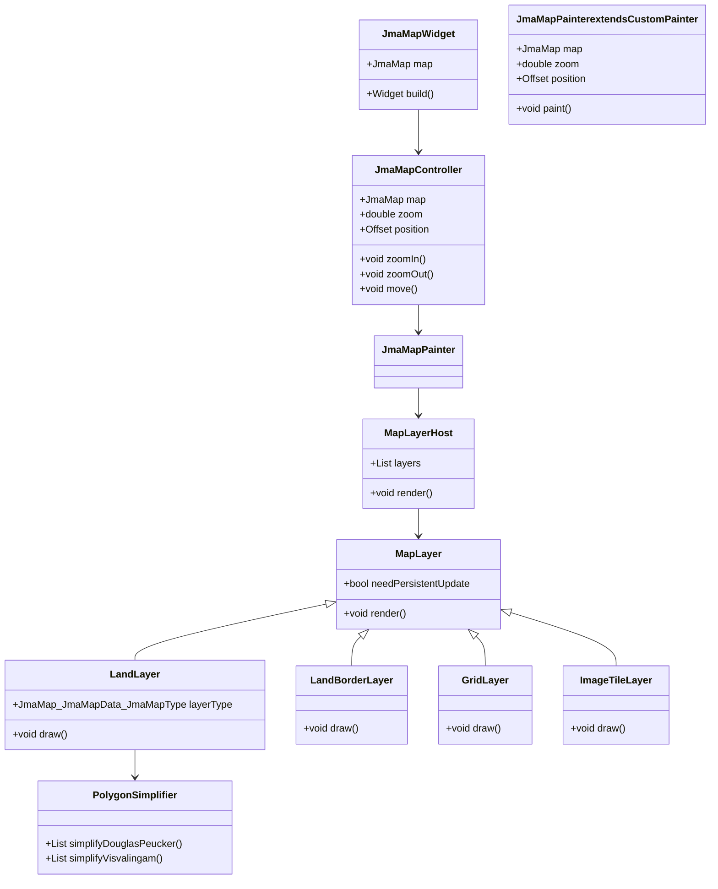

# JMA Map 実装計画（更新版）

## 概要

C#で実装された`KyoshinEewViewer.Map`を参考に、Flutterで地図描画機能を実装します。地図データはJMA Mapのプロトコルバッファを使用します。

## アーキテクチャ



## 主要コンポーネント

### 1. JmaMapWidget

- CustomPaintを使用して地図を描画するウィジェット
- ジェスチャー検出（ピンチズーム、パン）の実装
- JmaMapControllerを使用して状態を管理

```dart
class JmaMapWidget extends StatefulWidget {
  final JmaMap map;

  const JmaMapWidget({Key? key, required this.map}) : super(key: key);

  @override
  _JmaMapWidgetState createState() => _JmaMapWidgetState();
}
```

### 2. JmaMapController

- 地図の状態（ズーム、位置）を管理
- ジェスチャーに応じた状態更新
- レイヤーの管理
- MapLayerHostを保持

```dart
class JmaMapController {
  final JmaMap map;
  double zoom;
  Offset position;
  final MapLayerHost layerHost;

  // レイヤー設定
  List<JmaMapLayerSet> layerSets;

  // ズームレベルに応じたレイヤータイプの取得
  JmaMap_JmaMapData_JmaMapType getLayerType(double zoom) {
    // C#のLandLayerSetExtensionsに相当する実装
  }
}
```

### 3. MapLayerHost

- 複数のレイヤーを管理
- レイヤーの描画順序を制御
- レイヤーの表示/非表示を管理

```dart
class MapLayerHost {
  final List<MapLayer> layers;

  // レイヤーの描画
  bool render(Canvas canvas, LayerRenderParameter param, bool isAnimating) {
    // C#のMapLayerHost.Renderに相当する実装
  }
}
```

### 4. MapLayer（抽象クラス）

- すべてのレイヤーの基底クラス
- 描画ロジックの共通インターフェース

```dart
abstract class MapLayer {
  // 連続した更新が必要かどうか
  bool get needPersistentUpdate;

  // 描画処理
  void render(Canvas canvas, LayerRenderParameter param, bool isAnimating);
}
```

### 5. LandLayer

- 地形ポリゴンを描画するレイヤー
- C#の`LandLayer`に相当

```dart
class LandLayer extends MapLayer {
  final JmaMap map;
  final List<JmaMapLayerSet> layerSets;

  @override
  void render(Canvas canvas, LayerRenderParameter param, bool isAnimating) {
    // C#のLandLayer.Renderに相当する実装
  }
}
```

### 6. LandBorderLayer

- 地形の境界線を描画するレイヤー
- C#の`LandBorderLayer`に相当

```dart
class LandBorderLayer extends MapLayer {
  final JmaMap map;
  final List<JmaMapLayerSet> layerSets;

  @override
  void render(Canvas canvas, LayerRenderParameter param, bool isAnimating) {
    // C#のLandBorderLayer.Renderに相当する実装
  }
}
```

### 7. GridLayer

- 緯度経度のグリッド線を描画するレイヤー
- C#の`GridLayer`に相当

```dart
class GridLayer extends MapLayer {
  @override
  void render(Canvas canvas, LayerRenderParameter param, bool isAnimating) {
    // C#のGridLayer.Renderに相当する実装
  }
}
```

### 8. ImageTileLayer

- タイル画像を描画するレイヤー
- C#の`ImageTileLayer`に相当

```dart
class ImageTileLayer extends MapLayer {
  final ImageTileProvider provider;

  @override
  void render(Canvas canvas, LayerRenderParameter param, bool isAnimating) {
    // C#のImageTileLayer.Renderに相当する実装
  }
}
```

### 9. PolygonSimplifier

- ポリゴンの単純化アルゴリズムを実装
- C#の`DouglasPeucker`と`Visvalingam`に相当する機能

```dart
class PolygonSimplifier {
  // Douglas-Peuckerアルゴリズム
  static List<LatLng> simplifyDouglasPeucker(List<LatLng> points, double tolerance) {
    // C#のDouglasPeucker.Reductionに相当する実装
  }

  // Visvalingamアルゴリズム
  static List<LatLng> simplifyVisvalingam(List<LatLng> points, double minArea) {
    // C#のVisvalingam.Simplifyに相当する実装
  }
}
```

### 10. LayerRenderParameter

- レイヤー描画に必要なパラメータを保持
- C#の`LayerRenderParameter`に相当

```dart
class LayerRenderParameter {
  final double zoom;
  final LatLng leftTopLocation;
  final Offset leftTopPixel;
  final Rect pixelBound;
  final Rect viewAreaRect;
  final EdgeInsets padding;
}
```

## パフォーマンス最適化

1. **ポリゴンの単純化**
   - Douglas-PeuckerとVisvalingamアルゴリズムを使用
   - ズームレベルに応じた詳細度の調整

2. **非同期処理**
   - パスの生成を非同期で行い、UIスレッドをブロックしない
   - Isolateを使用した並列処理の検討
   - C#の`PolygonFeature.GetOrCreatePath`に相当する非同期パス生成

3. **キャッシュ機構**
   - 生成したパスをキャッシュして再利用
   - メモリ使用量を監視し、不要なキャッシュを定期的にクリア
   - C#の`PathCache`に相当するキャッシュ機構

4. **レイヤー管理**
   - ズームレベルに応じて適切なレイヤーを選択
   - 画面外のポリゴンは描画しない最適化
   - C#の`LandLayerSet`に相当するズームレベル管理

5. **描画の最適化**
   - クリッピングを使用して画面外の描画を防止
   - 低解像度のズームレベルでは詳細を省略
   - 描画中のアニメーション時は品質を落とす

## 実装ステップ

1. **基本構造の実装**
   - JmaMapWidgetとJmaMapControllerの基本実装
   - ジェスチャー検出の実装
   - MapLayerHostの実装

2. **レイヤー基盤の実装**
   - MapLayer抽象クラスの実装
   - LayerRenderParameterの実装

3. **基本レイヤーの実装**
   - GridLayerの実装
   - LandLayerの基本実装

4. **ポリゴン単純化の実装**
   - PolygonSimplifierの実装
   - パフォーマンステスト

5. **高度なレイヤーの実装**
   - LandBorderLayerの実装
   - ImageTileLayerの実装（必要に応じて）

6. **最適化**
   - キャッシュ機構の実装
   - 非同期処理の実装
   - パフォーマンスチューニング
