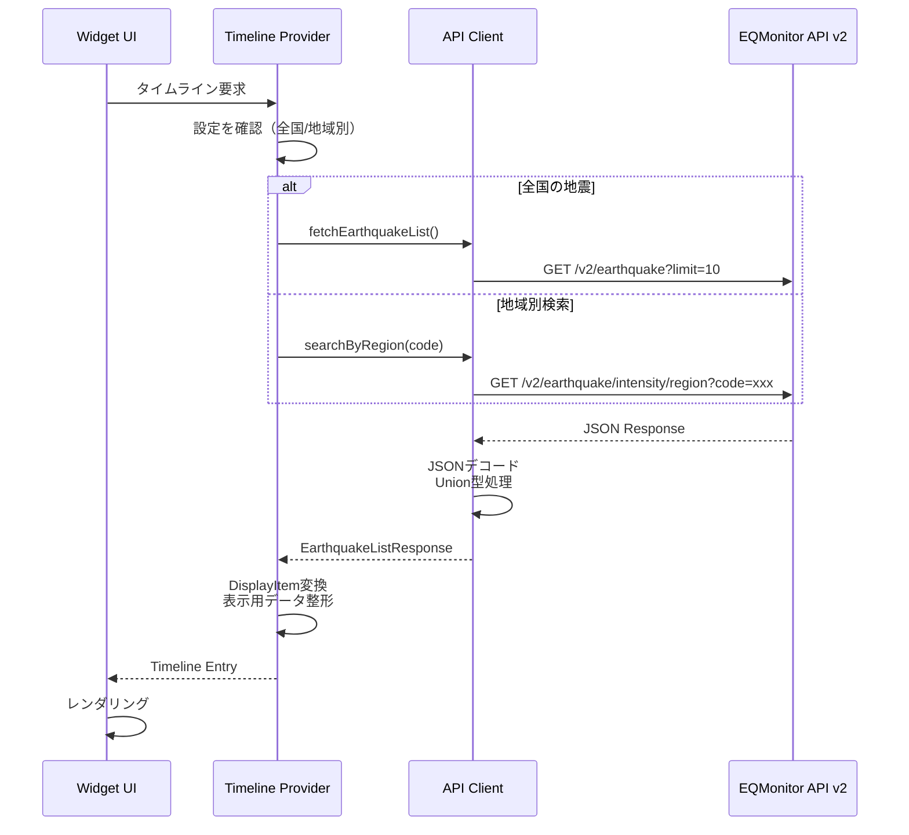
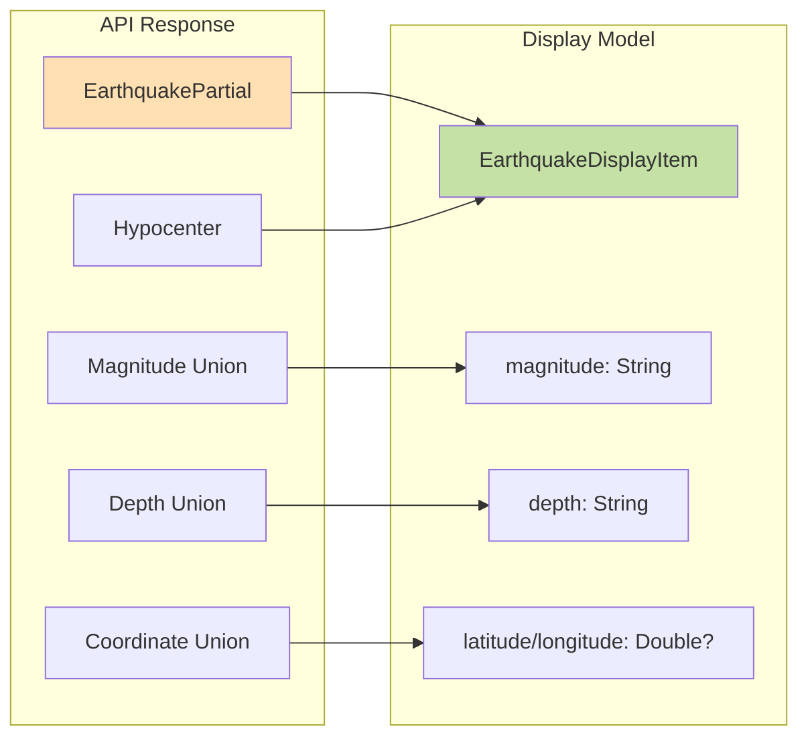
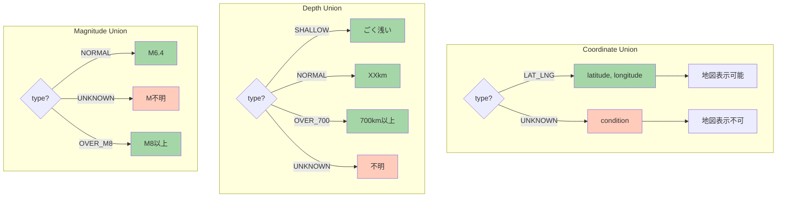
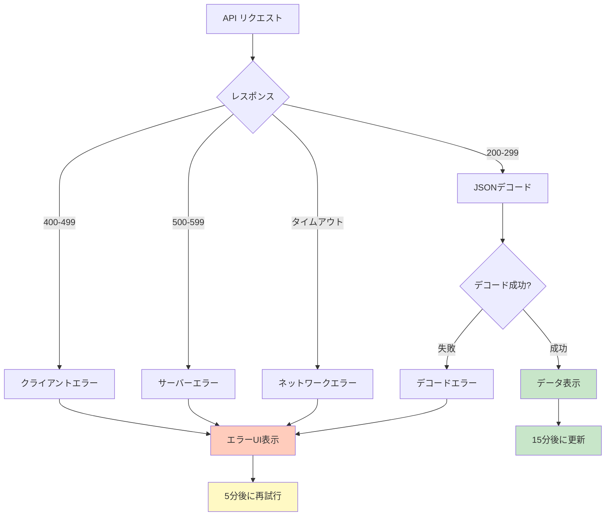
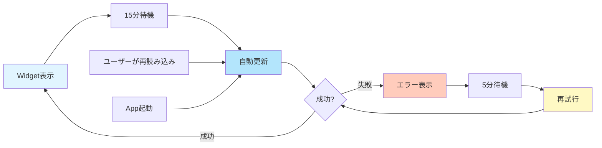
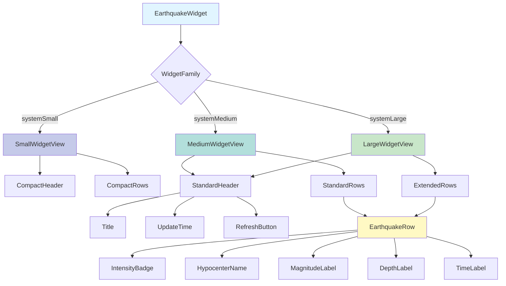
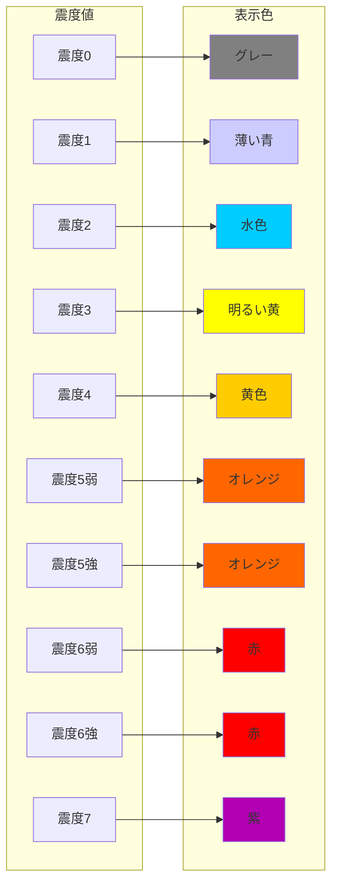
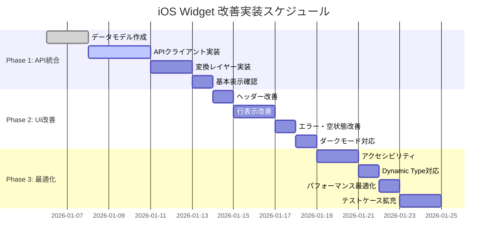
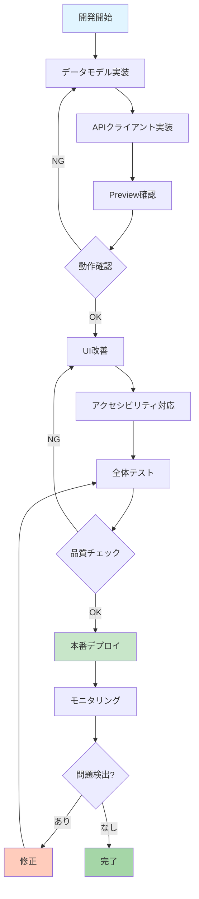
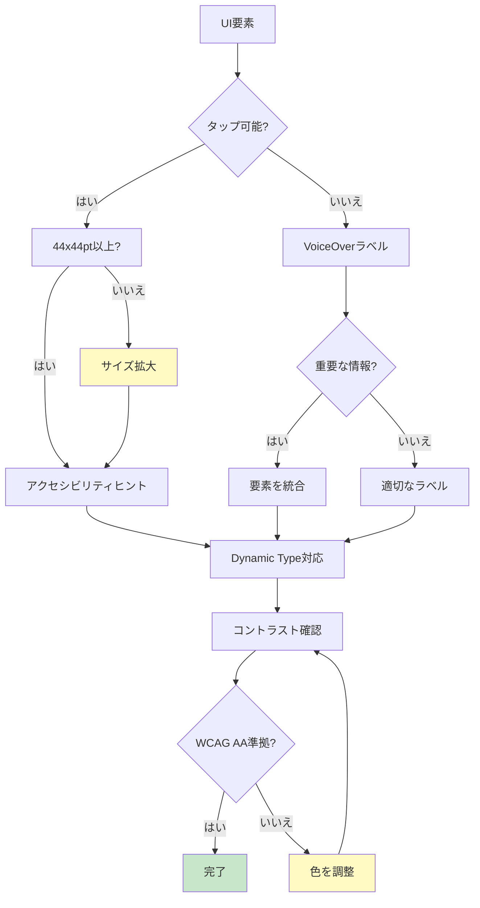

# iOS Widget アーキテクチャ図

## システムアーキテクチャ

```mermaid
graph TB
    subgraph "iOS Widget"
        WE[Widget Extension]
        TP[Timeline Provider]
        WV[Widget Views]
        AI[App Intents]
    end

    subgraph "Data Layer"
        API[API Client]
        DM[Data Models]
        TC[Type Converter]
    end

    subgraph "UI Layer"
        HV[Header View]
        RV[Row Views]
        EV[Error/Empty Views]
        AC[Adaptive Colors]
    end

    subgraph "EQMonitor API v2"
        EQ[/v2/earthquake]
        REG[/v2/earthquake/intensity/region]
        PREF[/v2/earthquake/intensity/prefecture]
    end

    WE --> TP
    TP --> API
    TP --> WV
    WV --> HV
    WV --> RV
    WV --> EV
    WV --> AC
    AI --> TP

    API --> DM
    DM --> TC
    TC --> WV

    API --> EQ
    API --> REG
    API --> PREF

    style WE fill:#e1f5ff
    style TP fill:#b3e5fc
    style API fill:#ffecb3
    style DM fill:#fff9c4
    style WV fill:#c8e6c9
```

## データフロー図



## データ変換フロー



## Union型の処理フロー



## エラーハンドリングフロー



## Widget更新サイクル



## UI コンポーネント階層



## 震度表示の色マッピング



## 実装フェーズ



## デプロイメントフロー



## アクセシビリティ対応フロー



---

これらの図により、システムの全体像と実装の流れが視覚的に理解できます。
